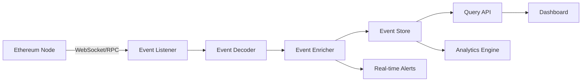

# Account Control Audit Trail Implementation Guide

**Version**: 1.0  
**Date**: 2025-01-08  
**Purpose**: Technical implementation guide for audit trail system  
**Target**: Backend developers and data engineers

---

## 1. Event Indexing Architecture

### 1.1 Event Processing Pipeline



### 1.2 Event Listener Implementation

```typescript
import { ethers } from 'ethers';
import { EventProcessor } from './EventProcessor';

class AccountControlEventListener {
    private contracts: Map<string, ethers.Contract>;
    private processor: EventProcessor;
    
    constructor(
        private provider: ethers.Provider,
        private config: ContractConfig[]
    ) {
        this.contracts = new Map();
        this.processor = new EventProcessor();
        this.initializeContracts();
    }
    
    private initializeContracts() {
        this.config.forEach(({ name, address, abi }) => {
            const contract = new ethers.Contract(address, abi, this.provider);
            this.contracts.set(name, contract);
            this.subscribeToEvents(name, contract);
        });
    }
    
    private subscribeToEvents(contractName: string, contract: ethers.Contract) {
        // Subscribe to all events
        contract.on("*", async (event) => {
            try {
                const processedEvent = await this.processor.process({
                    contractName,
                    event,
                    blockNumber: event.blockNumber,
                    transactionHash: event.transactionHash,
                    timestamp: await this.getBlockTimestamp(event.blockNumber)
                });
                
                await this.storeEvent(processedEvent);
                await this.checkAlerts(processedEvent);
                
            } catch (error) {
                console.error(`Error processing event from ${contractName}:`, error);
            }
        });
    }
    
    private async getBlockTimestamp(blockNumber: number): Promise<number> {
        const block = await this.provider.getBlock(blockNumber);
        return block.timestamp;
    }
}
```

### 1.3 Event Decoder and Enricher

```typescript
interface ProcessedEvent {
    id: string;                    // Unique event ID
    contractName: string;          // Source contract
    eventName: string;            // Event name
    blockNumber: number;
    transactionHash: string;
    timestamp: number;
    logIndex: number;
    
    // Decoded data
    args: Record<string, any>;
    
    // Enriched data
    actorRole?: string;           // Role of the address that triggered
    qcStatus?: string;            // QC status at time of event
    correlationId?: string;       // For linking related events
    flowType?: string;            // Minting, Redemption, etc.
}

class EventProcessor {
    async process(rawEvent: RawEvent): Promise<ProcessedEvent> {
        const decoded = this.decodeEvent(rawEvent);
        const enriched = await this.enrichEvent(decoded);
        return enriched;
    }
    
    private decodeEvent(raw: RawEvent): DecodedEvent {
        // Decode based on event signature
        const eventFragment = raw.contract.interface.getEvent(raw.event.topics[0]);
        const args = raw.contract.interface.decodeEventLog(
            eventFragment,
            raw.event.data,
            raw.event.topics
        );
        
        return {
            ...raw,
            eventName: eventFragment.name,
            args: this.serializeArgs(args)
        };
    }
    
    private async enrichEvent(decoded: DecodedEvent): Promise<ProcessedEvent> {
        const enriched: ProcessedEvent = {
            ...decoded,
            id: this.generateEventId(decoded),
            correlationId: this.extractCorrelationId(decoded),
            flowType: this.determineFlowType(decoded)
        };
        
        // Add role information
        if (decoded.args.sender || decoded.args.caller) {
            enriched.actorRole = await this.getActorRole(
                decoded.args.sender || decoded.args.caller
            );
        }
        
        // Add QC status for QC-related events
        if (decoded.args.qc) {
            enriched.qcStatus = await this.getQCStatus(decoded.args.qc);
        }
        
        return enriched;
    }
    
    private extractCorrelationId(event: DecodedEvent): string | undefined {
        // Extract correlation IDs based on event type
        if (event.args.mintId) return event.args.mintId;
        if (event.args.redemptionId) return event.args.redemptionId;
        if (event.args.proposalId) return event.args.proposalId;
        
        // For wallet operations, create composite key
        if (event.args.qc && event.args.btcAddress) {
            return ethers.utils.keccak256(
                ethers.utils.solidityPack(
                    ['address', 'string'],
                    [event.args.qc, event.args.btcAddress]
                )
            );
        }
        
        return undefined;
    }
}
```

---

## 2. Event Storage Schema

### 2.1 PostgreSQL Schema

```sql
-- Core event storage
CREATE TABLE events (
    id UUID PRIMARY KEY DEFAULT gen_random_uuid(),
    contract_name VARCHAR(50) NOT NULL,
    event_name VARCHAR(100) NOT NULL,
    block_number BIGINT NOT NULL,
    transaction_hash VARCHAR(66) NOT NULL,
    timestamp TIMESTAMP NOT NULL,
    log_index INT NOT NULL,
    
    -- Event arguments (JSONB for flexibility)
    args JSONB NOT NULL,
    
    -- Enriched data
    actor_role VARCHAR(50),
    qc_status VARCHAR(20),
    correlation_id VARCHAR(66),
    flow_type VARCHAR(50),
    
    -- Indexes
    created_at TIMESTAMP DEFAULT NOW(),
    
    UNIQUE(transaction_hash, log_index)
);

-- Indexes for common queries
CREATE INDEX idx_events_contract_event ON events(contract_name, event_name);
CREATE INDEX idx_events_timestamp ON events(timestamp);
CREATE INDEX idx_events_correlation_id ON events(correlation_id) WHERE correlation_id IS NOT NULL;
CREATE INDEX idx_events_qc ON events((args->>'qc')) WHERE args->>'qc' IS NOT NULL;
CREATE INDEX idx_events_user ON events((args->>'user')) WHERE args->>'user' IS NOT NULL;

-- Materialized views for performance
CREATE MATERIALIZED VIEW qc_current_state AS
SELECT DISTINCT ON (qc_address)
    args->>'qc' as qc_address,
    args->>'newStatus' as current_status,
    args->>'maxMintingCap' as minting_capacity,
    timestamp as last_updated
FROM events
WHERE event_name IN ('QCStatusChanged', 'QCOnboarded', 'MintingCapIncreased')
ORDER BY qc_address, timestamp DESC;

-- Flow correlation table
CREATE TABLE flow_correlations (
    correlation_id VARCHAR(66) PRIMARY KEY,
    flow_type VARCHAR(50) NOT NULL,
    start_time TIMESTAMP NOT NULL,
    end_time TIMESTAMP,
    status VARCHAR(20) NOT NULL, -- PENDING, COMPLETED, FAILED
    metadata JSONB
);
```

### 2.2 Event Aggregation Tables

```sql
-- QC metrics aggregation
CREATE TABLE qc_metrics (
    qc_address VARCHAR(42) NOT NULL,
    date DATE NOT NULL,
    
    -- Daily metrics
    mint_count INT DEFAULT 0,
    mint_volume NUMERIC(78, 0) DEFAULT 0,
    redemption_count INT DEFAULT 0,
    redemption_volume NUMERIC(78, 0) DEFAULT 0,
    failed_operations INT DEFAULT 0,
    
    -- Snapshot data
    ending_minted_amount NUMERIC(78, 0),
    ending_reserve_balance NUMERIC(78, 0),
    capacity_utilization DECIMAL(5, 2),
    
    PRIMARY KEY (qc_address, date)
);

-- System-wide metrics
CREATE TABLE system_metrics (
    date DATE PRIMARY KEY,
    active_qcs INT,
    total_minted NUMERIC(78, 0),
    total_reserves NUMERIC(78, 0),
    operations_count INT,
    failed_operations INT,
    average_mint_time INTERVAL,
    average_redemption_time INTERVAL
);
```

---

## 3. Event Correlation Engine

### 3.1 Flow Correlation Logic

```typescript
class FlowCorrelator {
    async correlateFlow(event: ProcessedEvent): Promise<void> {
        if (!event.correlationId) return;
        
        const flow = await this.getOrCreateFlow(event.correlationId, event.flowType);
        
        // Update flow status based on event
        switch (event.eventName) {
            case 'QCMintRequested':
                await this.startMintFlow(flow, event);
                break;
                
            case 'MintCompleted':
                await this.completeMintFlow(flow, event);
                break;
                
            case 'MintRejected':
                await this.failMintFlow(flow, event);
                break;
                
            case 'RedemptionRequested':
                await this.startRedemptionFlow(flow, event);
                break;
                
            case 'RedemptionFulfilled':
            case 'RedemptionDefaulted':
                await this.completeRedemptionFlow(flow, event);
                break;
        }
    }
    
    private async startMintFlow(flow: Flow, event: ProcessedEvent) {
        flow.status = 'PENDING';
        flow.metadata = {
            qc: event.args.qc,
            user: event.args.user,
            amount: event.args.amount,
            startTime: event.timestamp
        };
        
        // Track flow steps
        flow.steps = [{
            eventName: event.eventName,
            timestamp: event.timestamp,
            status: 'COMPLETED'
        }];
        
        await this.saveFlow(flow);
    }
    
    private async completeMintFlow(flow: Flow, event: ProcessedEvent) {
        flow.status = 'COMPLETED';
        flow.endTime = event.timestamp;
        
        // Calculate metrics
        flow.metadata.duration = flow.endTime - flow.metadata.startTime;
        flow.metadata.gasUsed = await this.calculateTotalGas(flow.correlationId);
        
        // Add final step
        flow.steps.push({
            eventName: event.eventName,
            timestamp: event.timestamp,
            status: 'COMPLETED'
        });
        
        await this.saveFlow(flow);
        await this.updateMetrics(flow);
    }
}
```

### 3.2 Complex Flow Reconstruction

```typescript
class FlowReconstructor {
    async reconstructMintingFlow(mintId: string): Promise<MintingFlow> {
        const events = await this.getEventsByCorrelationId(mintId);
        
        const flow: MintingFlow = {
            mintId,
            status: 'UNKNOWN',
            timeline: [],
            actors: new Set(),
            totalGas: 0,
            duration: 0
        };
        
        // Sort events chronologically
        events.sort((a, b) => a.timestamp - b.timestamp);
        
        // Build timeline
        for (const event of events) {
            flow.timeline.push({
                timestamp: event.timestamp,
                event: event.eventName,
                contract: event.contractName,
                actor: event.args.sender || event.args.caller,
                details: this.extractRelevantDetails(event)
            });
            
            // Track actors
            if (event.args.sender) flow.actors.add(event.args.sender);
            
            // Determine final status
            if (event.eventName === 'MintCompleted') flow.status = 'COMPLETED';
            if (event.eventName === 'MintRejected') flow.status = 'FAILED';
        }
        
        // Calculate metrics
        if (flow.timeline.length > 0) {
            flow.duration = flow.timeline[flow.timeline.length - 1].timestamp - 
                          flow.timeline[0].timestamp;
        }
        
        return flow;
    }
    
    async reconstructRedemptionLifecycle(redemptionId: string): Promise<RedemptionLifecycle> {
        const events = await this.getEventsByCorrelationId(redemptionId);
        
        const lifecycle: RedemptionLifecycle = {
            redemptionId,
            phases: {
                request: null,
                burn: null,
                fulfillment: null,
                default: null
            },
            currentPhase: 'UNKNOWN',
            isTimedOut: false
        };
        
        for (const event of events) {
            switch (event.eventName) {
                case 'RedemptionRequested':
                    lifecycle.phases.request = {
                        timestamp: event.timestamp,
                        user: event.args.user,
                        qc: event.args.qc,
                        amount: event.args.amount,
                        btcAddress: event.args.userBtcAddress
                    };
                    lifecycle.currentPhase = 'REQUESTED';
                    break;
                    
                case 'Transfer': // tBTC burn
                    if (event.args.to === '0x0000000000000000000000000000000000000000') {
                        lifecycle.phases.burn = {
                            timestamp: event.timestamp,
                            amount: event.args.value
                        };
                        lifecycle.currentPhase = 'BURNED';
                    }
                    break;
                    
                case 'RedemptionFulfilled':
                    lifecycle.phases.fulfillment = {
                        timestamp: event.timestamp,
                        txHash: await this.getBitcoinTxHash(redemptionId),
                        fulfilledBy: event.args.fulfilledBy
                    };
                    lifecycle.currentPhase = 'FULFILLED';
                    break;
                    
                case 'RedemptionDefaulted':
                    lifecycle.phases.default = {
                        timestamp: event.timestamp,
                        reason: event.args.reason,
                        defaultedBy: event.args.defaultedBy
                    };
                    lifecycle.currentPhase = 'DEFAULTED';
                    break;
            }
        }
        
        // Check timeout
        if (lifecycle.phases.request && !lifecycle.phases.fulfillment && !lifecycle.phases.default) {
            const timeout = await this.getRedemptionTimeout();
            const elapsed = Date.now() / 1000 - lifecycle.phases.request.timestamp;
            lifecycle.isTimedOut = elapsed > timeout;
        }
        
        return lifecycle;
    }
}
```

---

## 4. Real-Time Alert System

### 4.1 Alert Configuration

```typescript
interface AlertRule {
    id: string;
    name: string;
    severity: 'CRITICAL' | 'HIGH' | 'MEDIUM' | 'LOW';
    condition: AlertCondition;
    actions: AlertAction[];
    cooldown?: number; // Seconds before re-triggering
}

interface AlertCondition {
    type: 'EVENT' | 'METRIC' | 'PATTERN';
    
    // For event-based alerts
    eventName?: string;
    eventFilter?: (event: ProcessedEvent) => boolean;
    
    // For metric-based alerts
    metric?: string;
    operator?: '>' | '<' | '=' | '!=';
    threshold?: number;
    
    // For pattern-based alerts
    pattern?: string; // SQL or custom DSL
    timeWindow?: number; // Seconds
}

const alertRules: AlertRule[] = [
    {
        id: 'qc-revoked',
        name: 'QC Revoked Alert',
        severity: 'CRITICAL',
        condition: {
            type: 'EVENT',
            eventName: 'QCStatusChanged',
            eventFilter: (event) => event.args.newStatus === 'Revoked'
        },
        actions: [
            { type: 'SLACK', channel: '#critical-alerts' },
            { type: 'PAGERDUTY', serviceKey: 'qc-operations' },
            { type: 'EMAIL', recipients: ['security@example.com'] }
        ]
    },
    {
        id: 'redemption-approaching-timeout',
        name: 'Redemption Timeout Warning',
        severity: 'HIGH',
        condition: {
            type: 'PATTERN',
            pattern: `
                SELECT r.redemption_id
                FROM redemptions r
                WHERE r.status = 'PENDING'
                AND r.requested_at < NOW() - INTERVAL '18 hours'
                AND NOT EXISTS (
                    SELECT 1 FROM events e
                    WHERE e.correlation_id = r.redemption_id
                    AND e.event_name IN ('RedemptionFulfilled', 'RedemptionDefaulted')
                )
            `,
            timeWindow: 300 // Check every 5 minutes
        },
        actions: [
            { type: 'SLACK', channel: '#operations' },
            { type: 'WEBHOOK', url: 'https://api.example.com/alert' }
        ]
    },
    {
        id: 'high-failure-rate',
        name: 'High Operation Failure Rate',
        severity: 'MEDIUM',
        condition: {
            type: 'METRIC',
            metric: 'failure_rate_15m',
            operator: '>',
            threshold: 0.1 // 10% failure rate
        },
        actions: [
            { type: 'SLACK', channel: '#monitoring' }
        ],
        cooldown: 3600 // Don't re-alert for 1 hour
    }
];
```

### 4.2 Alert Engine Implementation

```typescript
class AlertEngine {
    private lastAlertTime: Map<string, number> = new Map();
    
    async checkAlerts(event?: ProcessedEvent): Promise<void> {
        for (const rule of alertRules) {
            try {
                const shouldAlert = await this.evaluateCondition(rule.condition, event);
                
                if (shouldAlert && this.canAlert(rule)) {
                    await this.triggerAlert(rule, event);
                    this.lastAlertTime.set(rule.id, Date.now());
                }
            } catch (error) {
                console.error(`Error evaluating alert rule ${rule.id}:`, error);
            }
        }
    }
    
    private async evaluateCondition(
        condition: AlertCondition, 
        event?: ProcessedEvent
    ): Promise<boolean> {
        switch (condition.type) {
            case 'EVENT':
                if (!event || event.eventName !== condition.eventName) return false;
                return condition.eventFilter ? condition.eventFilter(event) : true;
                
            case 'METRIC':
                const metricValue = await this.getMetric(condition.metric!);
                return this.compareMetric(metricValue, condition.operator!, condition.threshold!);
                
            case 'PATTERN':
                return await this.evaluatePattern(condition.pattern!, condition.timeWindow);
                
            default:
                return false;
        }
    }
    
    private canAlert(rule: AlertRule): boolean {
        if (!rule.cooldown) return true;
        
        const lastAlert = this.lastAlertTime.get(rule.id);
        if (!lastAlert) return true;
        
        return (Date.now() - lastAlert) / 1000 > rule.cooldown;
    }
    
    private async triggerAlert(rule: AlertRule, event?: ProcessedEvent): Promise<void> {
        const alert: Alert = {
            ruleId: rule.id,
            ruleName: rule.name,
            severity: rule.severity,
            timestamp: Date.now(),
            event: event ? this.summarizeEvent(event) : undefined,
            context: await this.gatherAlertContext(rule, event)
        };
        
        // Execute all configured actions
        await Promise.all(
            rule.actions.map(action => this.executeAction(action, alert))
        );
        
        // Log alert
        await this.logAlert(alert);
    }
}
```

---

## 5. Query API Implementation

### 5.1 GraphQL Schema

```graphql
type Query {
  # Event queries
  events(
    filter: EventFilter
    pagination: PaginationInput
    orderBy: EventOrderBy
  ): EventConnection!
  
  event(id: ID!): Event
  
  # Flow queries
  mintingFlow(mintId: String!): MintingFlow
  redemptionFlow(redemptionId: String!): RedemptionFlow
  
  # QC queries
  qc(address: String!): QCDetails
  qcs(filter: QCFilter): [QCSummary!]!
  
  # Metrics queries
  systemMetrics(timeRange: TimeRangeInput!): SystemMetrics
  qcMetrics(address: String!, timeRange: TimeRangeInput!): QCMetrics
  
  # Alert queries
  alerts(filter: AlertFilter): [Alert!]!
}

input EventFilter {
  contractName: String
  eventName: String
  qcAddress: String
  userAddress: String
  correlationId: String
  timeRange: TimeRangeInput
}

type Event {
  id: ID!
  contractName: String!
  eventName: String!
  blockNumber: Int!
  transactionHash: String!
  timestamp: DateTime!
  args: JSON!
  actorRole: String
  qcStatus: String
  correlationId: String
  flowType: String
}

type MintingFlow {
  mintId: String!
  status: FlowStatus!
  qc: String!
  user: String!
  amount: String!
  timeline: [FlowEvent!]!
  duration: Int
  gasUsed: String
}

type QCDetails {
  address: String!
  status: QCStatus!
  registeredAt: DateTime!
  mintingCapacity: String!
  currentMinted: String!
  reserveBalance: String!
  capacityUtilization: Float!
  
  # Related data
  wallets: [Wallet!]!
  recentOperations: [Operation!]!
  metrics: QCMetrics!
  alerts: [Alert!]!
}
```

### 5.2 REST API Endpoints

```typescript
// Express.js route definitions
router.get('/api/v1/events', async (req, res) => {
    const filter = parseEventFilter(req.query);
    const pagination = parsePagination(req.query);
    
    const events = await eventService.queryEvents(filter, pagination);
    res.json({
        data: events,
        pagination: {
            total: events.total,
            page: pagination.page,
            pageSize: pagination.pageSize
        }
    });
});

router.get('/api/v1/flows/minting/:mintId', async (req, res) => {
    const flow = await flowService.getMintingFlow(req.params.mintId);
    if (!flow) {
        return res.status(404).json({ error: 'Minting flow not found' });
    }
    res.json(flow);
});

router.get('/api/v1/qc/:address/audit', async (req, res) => {
    const { startDate, endDate } = req.query;
    const auditReport = await auditService.generateQCAuditReport(
        req.params.address,
        startDate,
        endDate
    );
    res.json(auditReport);
});

// WebSocket for real-time updates
io.on('connection', (socket) => {
    socket.on('subscribe', (filters) => {
        eventEmitter.on('newEvent', (event) => {
            if (matchesFilters(event, filters)) {
                socket.emit('event', event);
            }
        });
    });
});
```

---

## 6. Performance Optimization

### 6.1 Caching Strategy

```typescript
class EventCache {
    private redis: Redis;
    private cacheTTL = 300; // 5 minutes
    
    async getCachedQuery(queryKey: string): Promise<any | null> {
        const cached = await this.redis.get(queryKey);
        return cached ? JSON.parse(cached) : null;
    }
    
    async setCachedQuery(queryKey: string, data: any): Promise<void> {
        await this.redis.setex(queryKey, this.cacheTTL, JSON.stringify(data));
    }
    
    generateQueryKey(query: any): string {
        return crypto
            .createHash('sha256')
            .update(JSON.stringify(query))
            .digest('hex');
    }
}
```

### 6.2 Batch Processing

```typescript
class BatchEventProcessor {
    private batchSize = 1000;
    private batchTimeout = 5000; // 5 seconds
    private eventBatch: ProcessedEvent[] = [];
    private batchTimer: NodeJS.Timeout | null = null;
    
    async addEvent(event: ProcessedEvent): Promise<void> {
        this.eventBatch.push(event);
        
        if (this.eventBatch.length >= this.batchSize) {
            await this.processBatch();
        } else if (!this.batchTimer) {
            this.batchTimer = setTimeout(() => this.processBatch(), this.batchTimeout);
        }
    }
    
    private async processBatch(): Promise<void> {
        if (this.eventBatch.length === 0) return;
        
        const batch = [...this.eventBatch];
        this.eventBatch = [];
        
        if (this.batchTimer) {
            clearTimeout(this.batchTimer);
            this.batchTimer = null;
        }
        
        // Bulk insert with conflict handling
        await this.bulkInsertEvents(batch);
        
        // Trigger correlation in background
        setImmediate(() => this.correlateBatch(batch));
    }
}
```

---

## 7. Monitoring and Maintenance

### 7.1 Health Checks

```typescript
interface HealthCheck {
    name: string;
    status: 'HEALTHY' | 'DEGRADED' | 'UNHEALTHY';
    lastCheck: Date;
    details: any;
}

class SystemHealthMonitor {
    async checkHealth(): Promise<HealthCheck[]> {
        return Promise.all([
            this.checkEventIngestion(),
            this.checkDatabaseConnection(),
            this.checkAlertSystem(),
            this.checkDataConsistency()
        ]);
    }
    
    private async checkEventIngestion(): Promise<HealthCheck> {
        const latestEvent = await this.getLatestEvent();
        const lagSeconds = (Date.now() / 1000) - latestEvent.timestamp;
        
        return {
            name: 'Event Ingestion',
            status: lagSeconds < 60 ? 'HEALTHY' : lagSeconds < 300 ? 'DEGRADED' : 'UNHEALTHY',
            lastCheck: new Date(),
            details: { lagSeconds, latestBlock: latestEvent.blockNumber }
        };
    }
}
```

### 7.2 Data Maintenance Jobs

```typescript
// Cron job definitions
const maintenanceJobs = [
    {
        name: 'Update Materialized Views',
        schedule: '*/15 * * * *', // Every 15 minutes
        job: async () => {
            await db.query('REFRESH MATERIALIZED VIEW CONCURRENTLY qc_current_state');
            await db.query('REFRESH MATERIALIZED VIEW CONCURRENTLY daily_metrics');
        }
    },
    {
        name: 'Archive Old Events',
        schedule: '0 2 * * *', // Daily at 2 AM
        job: async () => {
            const cutoffDate = new Date();
            cutoffDate.setMonth(cutoffDate.getMonth() - 6);
            
            await archiveService.archiveEvents(cutoffDate);
        }
    },
    {
        name: 'Generate Daily Reports',
        schedule: '0 6 * * *', // Daily at 6 AM
        job: async () => {
            const yesterday = new Date();
            yesterday.setDate(yesterday.getDate() - 1);
            
            await reportService.generateDailyReport(yesterday);
        }
    }
];
```

---

## 8. Security Considerations

### 8.1 Access Control

```typescript
class AuditAPIAuth {
    authenticate(req: Request): AuthContext {
        const token = req.headers.authorization?.split(' ')[1];
        if (!token) throw new UnauthorizedError();
        
        const decoded = jwt.verify(token, process.env.JWT_SECRET);
        return {
            userId: decoded.sub,
            roles: decoded.roles,
            permissions: this.expandPermissions(decoded.roles)
        };
    }
    
    authorize(context: AuthContext, resource: string, action: string): boolean {
        const permission = `${resource}:${action}`;
        return context.permissions.includes(permission);
    }
}
```

### 8.2 Data Privacy

```typescript
class DataPrivacy {
    maskSensitiveData(event: ProcessedEvent): ProcessedEvent {
        const masked = { ...event };
        
        // Mask user addresses for privacy
        if (masked.args.user) {
            masked.args.user = this.maskAddress(masked.args.user);
        }
        
        // Mask Bitcoin addresses
        if (masked.args.btcAddress) {
            masked.args.btcAddress = this.maskBitcoinAddress(masked.args.btcAddress);
        }
        
        return masked;
    }
    
    private maskAddress(address: string): string {
        return `${address.slice(0, 6)}...${address.slice(-4)}`;
    }
}
```

---

## Implementation Checklist

- [ ] Set up event listening infrastructure
- [ ] Deploy PostgreSQL with proper schema
- [ ] Implement event processing pipeline
- [ ] Build correlation engine
- [ ] Create GraphQL/REST APIs
- [ ] Deploy alert system
- [ ] Set up monitoring dashboards
- [ ] Configure data retention policies
- [ ] Implement security measures
- [ ] Create operational runbooks