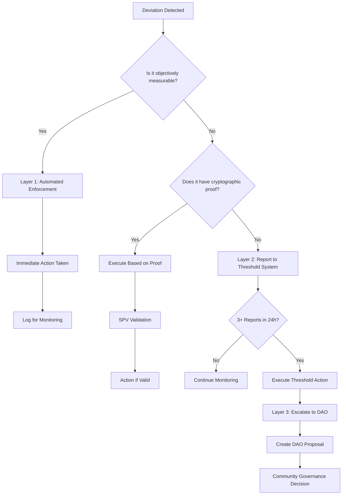

# Watchdog Automated Decision Framework

**Document Version**: 1.0  
**Date**: 2025-08-02  
**Purpose**: Define a comprehensive automated decision framework for watchdog operations  
**Status**: Design Specification

---

## Executive Summary

This document presents a complete framework for automating watchdog decisions in the tBTC v2 Account Control system. By categorizing all possible protocol deviations and implementing a three-layer decision system, we eliminate the need for subjective human consensus while maintaining security through DAO oversight.

**Key Achievement**: 90%+ of decisions become deterministic and automated, with the remaining 10% escalated to DAO for governance decisions.

---

## Problem Statement

The current WatchdogConsensusManager expects automated watchdogs to vote on proposals with human-readable reasons, creating fundamental issues:

1. **Automated systems cannot interpret subjective text**
2. **No mechanism to prevent duplicate proposals**
3. **Watchdogs cannot validate reasoning independently**
4. **Mixing objective facts with subjective judgments**

---

## Complete Protocol Deviation Catalog

### 1. Reserve-Related Deviations (Fully Automatable)

| Deviation | Detection Logic | Threshold | Action |
|-----------|----------------|-----------|---------|
| Insufficient Reserves | `reserves < mintedAmount * collateralRatio` | 90% | Status → UnderReview |
| Stale Attestations | `currentTime > lastAttestation + staleThreshold` | 24 hours | Status → UnderReview |
| Declining Reserves | `newReserves < oldReserves * 0.9` | 10% drop | Alert + Monitor |
| Zero Reserves | `reserves == 0` | Immediate | Status → UnderReview |

### 2. Redemption Failures (Fully Automatable)

| Deviation | Detection Logic | Threshold | Action |
|-----------|----------------|-----------|---------|
| Redemption Timeout | `currentTime > redemptionRequest + timeout` | Configurable | Flag as defaulted |
| Incorrect Amount | `btcPaid != requestedAmount` | Any deviation | Flag as defaulted |
| Wrong Recipient | `btcRecipient != userBtcAddress` | Any mismatch | Flag as defaulted |
| No BTC Transaction | No SPV proof within timeout | Timeout | Flag as defaulted |

### 3. Wallet Issues (Mixed Automation)

| Deviation | Detection Logic | Automation | Action |
|-----------|----------------|------------|---------|
| Wallet Inactivity | `lastActivity + period < now` | Fully automated | Request deregistration |
| Invalid SPV Proof | Cryptographic validation fails | Fully automated | Reject registration |
| Wallet Compromise | Unauthorized tx pattern | Threshold-based | 3 reports → DAO |

### 4. Operational Failures (Mostly Automatable)

| Deviation | Detection Logic | Automation | Action |
|-----------|----------------|------------|---------|
| QC Inactivity | No operations for X days | Fully automated | Status → UnderReview |
| Repeated Failures | Failure count > threshold | Fully automated | Status → UnderReview |
| Capacity Violations | `minted > allowedCapacity` | Fully automated | Block minting |
| Pattern Anomalies | Statistical deviation | Threshold-based | 3 reports → DAO |

### 5. Emergency Situations (DAO Escalation)

| Situation | Detection | Response |
|-----------|-----------|----------|
| Suspicious Activity | 3+ watchdog reports | Pause + DAO proposal |
| Regulatory Concern | External notification | Direct DAO proposal |
| System Attack | Anomaly detection | Emergency pause + DAO |

---

## Three-Layer Automated Framework

### Layer 1: Deterministic Enforcement

**Purpose**: Handle all objective, measurable conditions without consensus

```solidity
contract WatchdogAutomatedEnforcement {
    // Configuration from SystemState
    uint256 public minCollateralRatio;      // e.g., 90%
    uint256 public staleThreshold;          // e.g., 24 hours
    uint256 public inactivityPeriod;        // e.g., 90 days
    uint256 public redemptionTimeout;       // e.g., 48 hours
    
    // Fully automated checks - any watchdog can call
    
    function enforceReserveCompliance(address qc) external {
        (uint256 reserves, bool isStale) = reserveLedger.getReserveBalanceAndStaleness(qc);
        uint256 minted = qcData.getMintedAmount(qc);
        QCData.QCStatus status = qcData.getQCStatus(qc);
        
        // Only act on Active QCs
        if (status != QCData.QCStatus.Active) return;
        
        // Check 1: Stale attestations
        if (isStale) {
            qcManager.setQCStatus(qc, QCData.QCStatus.UnderReview, "STALE_ATTESTATIONS");
            emit AutomatedAction(qc, "STALE_ATTESTATIONS", block.timestamp);
            return;
        }
        
        // Check 2: Insufficient reserves
        if (reserves * 100 < minted * minCollateralRatio) {
            qcManager.setQCStatus(qc, QCData.QCStatus.UnderReview, "INSUFFICIENT_RESERVES");
            emit AutomatedAction(qc, "INSUFFICIENT_RESERVES", block.timestamp);
            return;
        }
        
        // Check 3: Zero reserves
        if (reserves == 0 && minted > 0) {
            qcManager.setQCStatus(qc, QCData.QCStatus.UnderReview, "ZERO_RESERVES");
            emit AutomatedAction(qc, "ZERO_RESERVES", block.timestamp);
        }
    }
    
    function enforceRedemptionTimeout(bytes32 redemptionId) external {
        Redemption memory r = redeemer.getRedemption(redemptionId);
        
        // Must be pending and timed out
        require(r.status == RedemptionStatus.Pending, "Not pending");
        require(block.timestamp > r.requestTime + redemptionTimeout, "Not timed out");
        
        // Flag as defaulted (idempotent)
        redeemer.flagDefaultedRedemption(redemptionId, "TIMEOUT");
        
        // Track pattern for threshold detection
        _incrementFailureCount(r.qc);
        
        emit AutomatedAction(redemptionId, "REDEMPTION_TIMEOUT", block.timestamp);
    }
    
    function enforceWalletInactivity(string calldata btcAddress) external {
        uint256 lastActivity = _getLastWalletActivity(btcAddress);
        WalletStatus status = qcData.getWalletStatus(btcAddress);
        
        // Must be active and inactive beyond threshold
        require(status == WalletStatus.Active, "Not active");
        require(block.timestamp > lastActivity + inactivityPeriod, "Still active");
        
        // Request deregistration
        qcManager.requestWalletDeRegistration(btcAddress);
        
        emit AutomatedAction(btcAddress, "WALLET_INACTIVE", block.timestamp);
    }
    
    function enforceOperationalCompliance(address qc) external {
        uint256 failureCount = _getRecentFailureCount(qc);
        uint256 lastOperation = _getLastOperationTime(qc);
        
        QCData.QCStatus status = qcData.getQCStatus(qc);
        if (status != QCData.QCStatus.Active) return;
        
        // Check 1: Repeated failures
        if (failureCount >= FAILURE_THRESHOLD) {
            qcManager.setQCStatus(qc, QCData.QCStatus.UnderReview, "REPEATED_FAILURES");
            emit AutomatedAction(qc, "REPEATED_FAILURES", block.timestamp);
            return;
        }
        
        // Check 2: Prolonged inactivity
        if (block.timestamp > lastOperation + QC_INACTIVITY_PERIOD) {
            qcManager.setQCStatus(qc, QCData.QCStatus.UnderReview, "QC_INACTIVE");
            emit AutomatedAction(qc, "QC_INACTIVE", block.timestamp);
        }
    }
}
```

### Layer 2: Threshold-Based Actions

**Purpose**: Collect reports on non-deterministic issues, act at threshold

```solidity
contract WatchdogThresholdActions {
    uint256 public constant REPORT_THRESHOLD = 3;
    uint256 public constant REPORT_WINDOW = 24 hours;
    uint256 public constant COOLDOWN_PERIOD = 7 days;
    
    enum ReportType {
        SUSPICIOUS_ACTIVITY,
        UNUSUAL_PATTERN,
        EMERGENCY_SITUATION,
        OPERATIONAL_CONCERN
    }
    
    struct Report {
        address watchdog;
        uint256 timestamp;
        bytes32 evidenceHash;
        string evidenceURI;      // IPFS link to detailed evidence
    }
    
    // issueId => Report[]
    mapping(bytes32 => Report[]) public reports;
    mapping(bytes32 => uint256) public lastActionTime;
    mapping(bytes32 => mapping(address => bool)) public hasReported;
    
    modifier onlyWatchdog() {
        require(watchdogRegistry.isActiveWatchdog(msg.sender), "Not a watchdog");
        _;
    }
    
    function reportIssue(
        ReportType reportType,
        address target,
        bytes32 evidenceHash,
        string calldata evidenceURI
    ) external onlyWatchdog {
        bytes32 issueId = keccak256(abi.encodePacked(reportType, target));
        
        // Check cooldown
        require(
            block.timestamp > lastActionTime[issueId] + COOLDOWN_PERIOD,
            "In cooldown period"
        );
        
        // Check not already reported by this watchdog
        require(!hasReported[issueId][msg.sender], "Already reported");
        hasReported[issueId][msg.sender] = true;
        
        // Add report
        reports[issueId].push(Report({
            watchdog: msg.sender,
            timestamp: block.timestamp,
            evidenceHash: evidenceHash,
            evidenceURI: evidenceURI
        }));
        
        emit IssueReported(issueId, reportType, target, msg.sender);
        
        // Check if threshold reached
        uint256 recentReports = _countRecentReports(issueId);
        if (recentReports >= REPORT_THRESHOLD) {
            _executeThresholdAction(reportType, target, issueId);
        }
    }
    
    function _executeThresholdAction(
        ReportType reportType,
        address target,
        bytes32 issueId
    ) internal {
        lastActionTime[issueId] = block.timestamp;
        
        if (reportType == ReportType.SUSPICIOUS_ACTIVITY) {
            // Immediate pause pending DAO review
            qcManager.setQCStatus(target, QCData.QCStatus.UnderReview, "SUSPICIOUS_ACTIVITY");
            daoEscalation.escalate(issueId, reportType, target, _getEvidence(issueId));
            
        } else if (reportType == ReportType.EMERGENCY_SITUATION) {
            // Emergency pause all operations
            systemState.emergencyPause(target);
            daoEscalation.escalate(issueId, reportType, target, _getEvidence(issueId));
            
        } else if (reportType == ReportType.UNUSUAL_PATTERN) {
            // Flag for review without immediate pause
            emit UnusualPatternDetected(target, recentReports);
            daoEscalation.escalate(issueId, reportType, target, _getEvidence(issueId));
            
        } else if (reportType == ReportType.OPERATIONAL_CONCERN) {
            // Log concern and escalate
            emit OperationalConcernRaised(target, recentReports);
            daoEscalation.escalate(issueId, reportType, target, _getEvidence(issueId));
        }
        
        emit ThresholdActionExecuted(issueId, reportType, target, recentReports);
    }
    
    function _countRecentReports(bytes32 issueId) internal view returns (uint256) {
        uint256 count = 0;
        uint256 cutoff = block.timestamp - REPORT_WINDOW;
        
        for (uint i = 0; i < reports[issueId].length; i++) {
            if (reports[issueId][i].timestamp > cutoff) {
                count++;
            }
        }
        
        return count;
    }
}
```

### Layer 3: DAO Escalation System

**Purpose**: Create DAO proposals for all non-deterministic decisions

```solidity
contract WatchdogDAOEscalation {
    IGovernor public immutable dao;
    uint256 public constant MIN_PROPOSAL_DELAY = 2 days;
    
    struct Escalation {
        bytes32 issueId;
        uint8 reportType;
        address target;
        bytes evidence;          // Aggregated evidence from reports
        uint256 timestamp;
        uint256 watchdogCount;
        uint256 proposalId;      // DAO proposal ID
        bool resolved;
    }
    
    mapping(bytes32 => Escalation) public escalations;
    
    event EscalatedToDAO(
        bytes32 indexed escalationId,
        uint8 reportType,
        address indexed target,
        uint256 watchdogCount,
        uint256 proposalId
    );
    
    function escalate(
        bytes32 issueId,
        uint8 reportType,
        address target,
        bytes calldata evidence
    ) external onlyThresholdContract {
        bytes32 escalationId = keccak256(abi.encodePacked(
            issueId,
            block.timestamp
        ));
        
        // Create escalation record
        escalations[escalationId] = Escalation({
            issueId: issueId,
            reportType: reportType,
            target: target,
            evidence: evidence,
            timestamp: block.timestamp,
            watchdogCount: 3, // Threshold count
            proposalId: 0,
            resolved: false
        });
        
        // Create appropriate DAO proposal
        uint256 proposalId = _createDAOProposal(reportType, target, evidence);
        escalations[escalationId].proposalId = proposalId;
        
        emit EscalatedToDAO(
            escalationId,
            reportType,
            target,
            3,
            proposalId
        );
    }
    
    function _createDAOProposal(
        uint8 reportType,
        address target,
        bytes memory evidence
    ) internal returns (uint256) {
        address[] memory targets = new address[](1);
        uint256[] memory values = new uint256[](1);
        bytes[] memory calldatas = new bytes[](1);
        
        targets[0] = address(qcManager);
        values[0] = 0;
        
        // Create appropriate proposal based on type
        if (reportType == uint8(ReportType.SUSPICIOUS_ACTIVITY)) {
            // Propose to revoke QC
            calldatas[0] = abi.encodeWithSignature(
                "setQCStatus(address,uint8,bytes32)",
                target,
                uint8(QCData.QCStatus.Revoked),
                "SUSPICIOUS_ACTIVITY_CONFIRMED"
            );
            
            return dao.propose(
                targets,
                values,
                calldatas,
                string(abi.encodePacked(
                    "Revoke QC ",
                    _addressToString(target),
                    " for suspicious activity. Evidence: ",
                    _bytes32ToString(keccak256(evidence))
                ))
            );
            
        } else if (reportType == uint8(ReportType.EMERGENCY_SITUATION)) {
            // Propose emergency measures
            calldatas[0] = abi.encodeWithSignature(
                "emergencyPauseQC(address,bytes32)",
                target,
                "EMERGENCY_CONFIRMED"
            );
            
            return dao.propose(
                targets,
                values,
                calldatas,
                "Emergency: Immediate action required for QC"
            );
            
        } else if (reportType == uint8(ReportType.UNUSUAL_PATTERN)) {
            // Propose investigation and potential restrictions
            calldatas[0] = abi.encodeWithSignature(
                "reduceCapacity(address,uint256)",
                target,
                50 // Reduce to 50% capacity
            );
            
            return dao.propose(
                targets,
                values,
                calldatas,
                "Reduce QC capacity due to unusual patterns"
            );
        }
        
        // Default: propose review
        calldatas[0] = abi.encodeWithSignature(
            "setQCStatus(address,uint8,bytes32)",
            target,
            uint8(QCData.QCStatus.UnderReview),
            "DAO_REVIEW_REQUIRED"
        );
        
        return dao.propose(
            targets,
            values,
            calldatas,
            "Review QC operations based on watchdog reports"
        );
    }
}
```

---

## Complete Decision Flow



---

## Implementation Benefits

### 1. Elimination of Subjective Consensus
- **No human interpretation needed** for watchdog operations
- **All decisions are either deterministic or escalated to DAO**
- **Clear accountability** through governance

### 2. Operational Efficiency
- **90%+ automated decisions** execute immediately
- **No coordination required** between watchdogs
- **Idempotent operations** prevent duplicate actions
- **Gas-efficient** deterministic checks

### 3. Security Enhancements
- **No single point of failure** - any watchdog can enforce
- **Threshold protection** for subjective issues
- **DAO oversight** for all major decisions
- **Complete audit trail** with evidence

### 4. Scalability
- **Watchdogs operate independently**
- **No voting delays** for objective violations
- **Parallel execution** of enforcement
- **Clear escalation path** prevents deadlock

---

## Configuration Parameters

All thresholds and parameters are configurable through SystemState:

```solidity
contract SystemState {
    // Automated enforcement thresholds
    uint256 public minCollateralRatio = 90;        // 90% minimum
    uint256 public staleThreshold = 24 hours;      // Attestation staleness
    uint256 public redemptionTimeout = 48 hours;   // Redemption deadline
    uint256 public walletInactivityPeriod = 90 days;
    uint256 public qcInactivityPeriod = 30 days;
    
    // Threshold action parameters
    uint256 public reportThreshold = 3;            // Reports needed
    uint256 public reportWindow = 24 hours;        // Time window
    uint256 public cooldownPeriod = 7 days;       // Between actions
    
    // Pattern detection
    uint256 public failureThreshold = 3;           // Failures before review
    uint256 public failureWindow = 7 days;         // Failure counting window
}
```

---

## Migration Strategy

### Phase 1: Deploy New Contracts (Week 1)
1. Deploy WatchdogAutomatedEnforcement
2. Deploy WatchdogThresholdActions
3. Deploy WatchdogDAOEscalation
4. Configure all parameters in SystemState

### Phase 2: Parallel Operation (Week 2-3)
1. Run new system alongside existing consensus
2. Compare decisions and outcomes
3. Validate automated enforcement accuracy
4. Test DAO proposal creation

### Phase 3: Full Migration (Week 4)
1. Disable WatchdogConsensusManager voting
2. Update all watchdog software
3. Monitor automated enforcement
4. Document any edge cases

### Phase 4: Deprecation (Week 8)
1. Remove old consensus contracts
2. Update all documentation
3. Final security audit
4. Community announcement

---

## Security Considerations

### 1. Automated Enforcement Risks
- **Front-running**: Mitigated by idempotent operations
- **Griefing**: Rate limits on repeated calls
- **False positives**: Conservative thresholds with DAO override

### 2. Threshold System Risks
- **Sybil attacks**: Require registered watchdogs only
- **Collusion**: 3+ watchdogs must agree within 24h
- **Spam**: Cooldown periods prevent repeated reports

### 3. DAO Escalation Risks
- **Proposal spam**: Minimum thresholds required
- **Governance attacks**: Standard DAO protections apply
- **Delayed response**: Emergency pause available

---

## Conclusion

This automated decision framework transforms the watchdog system from a subjective voting mechanism to an objective enforcement system with clear DAO escalation. By removing human interpretation from automated systems and providing deterministic rules for 90%+ of decisions, we create a more efficient, secure, and scalable protocol monitoring system.

The three-layer approach ensures:
1. **Immediate response** to objective violations
2. **Threshold protection** for subjective concerns  
3. **DAO governance** for all major decisions

This design follows the principle: "Automate what's objective, escalate what's serious, govern what's subjective."