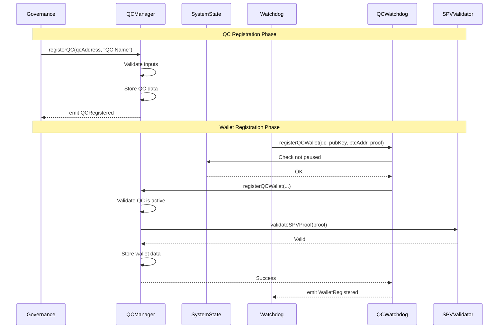
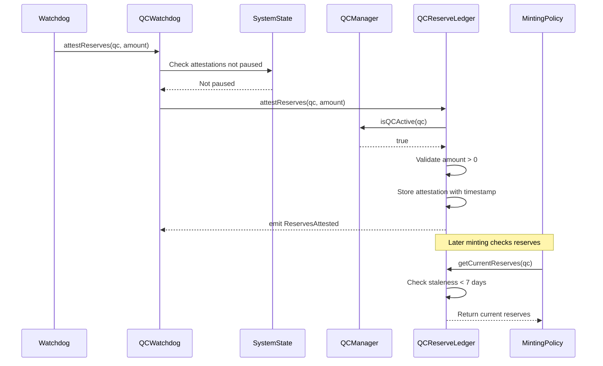
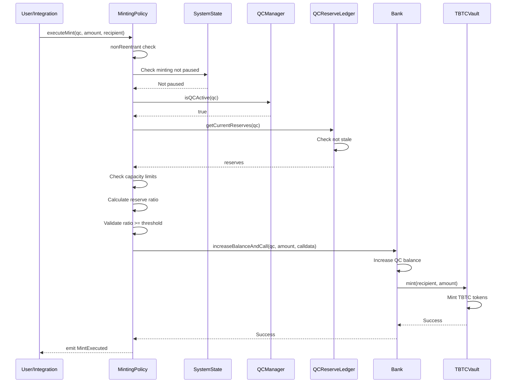
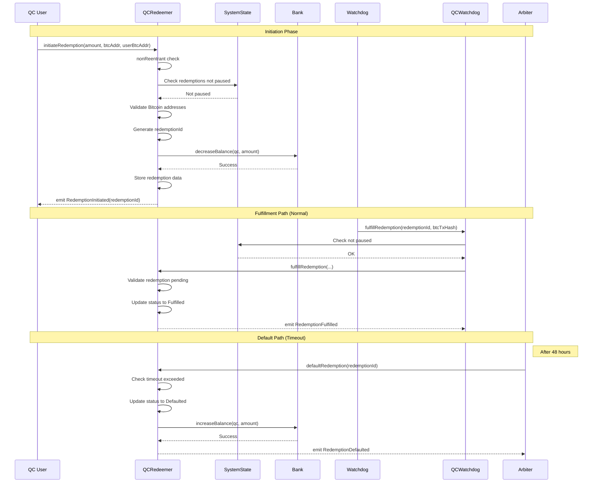
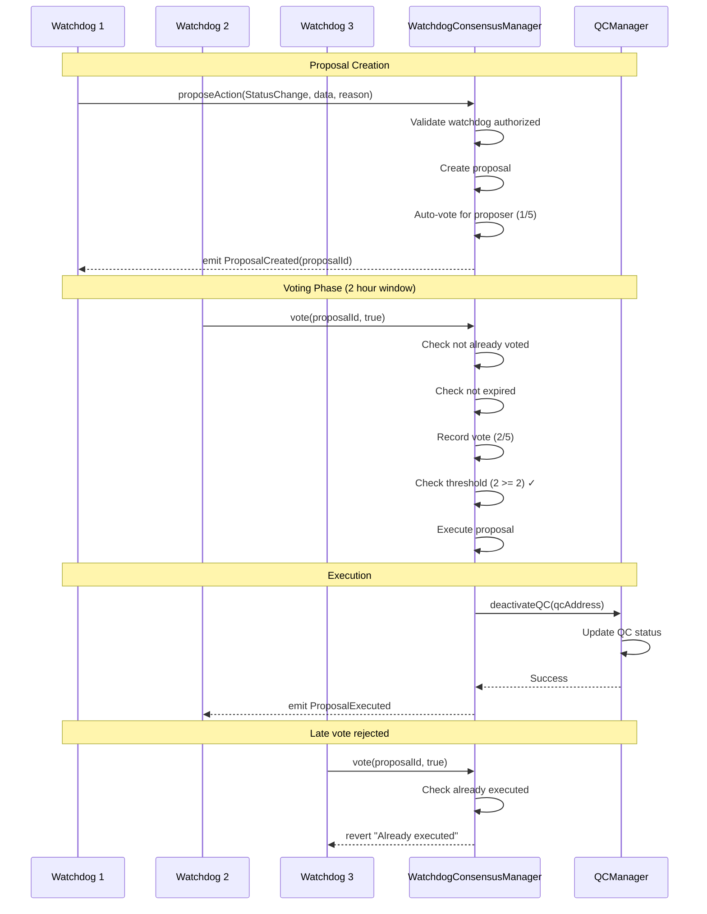
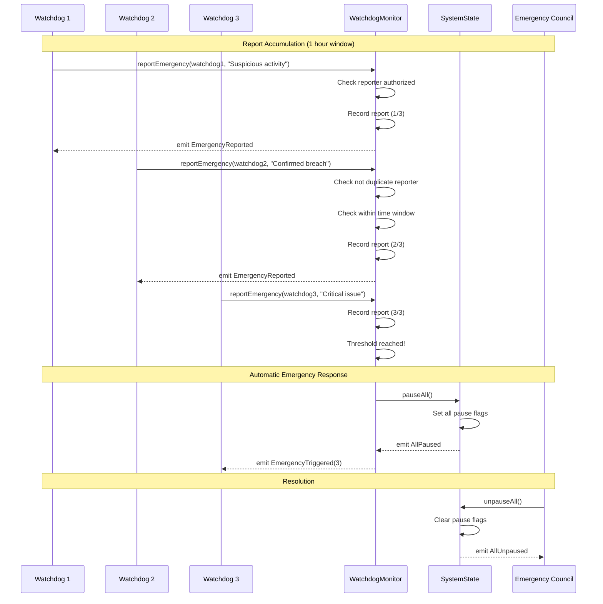
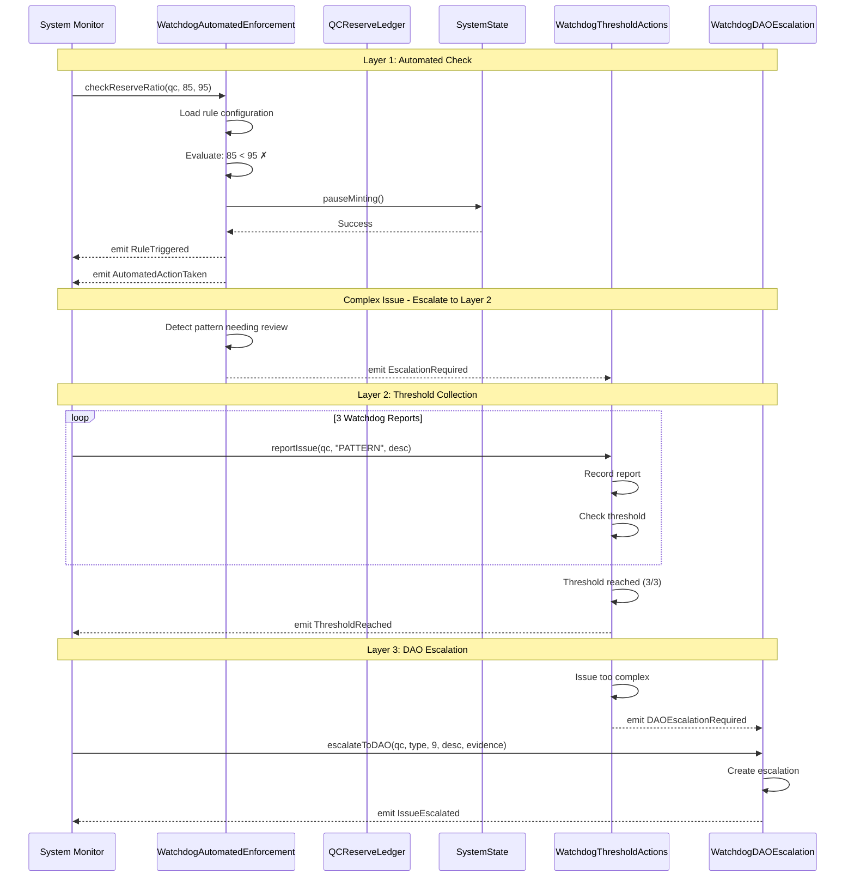
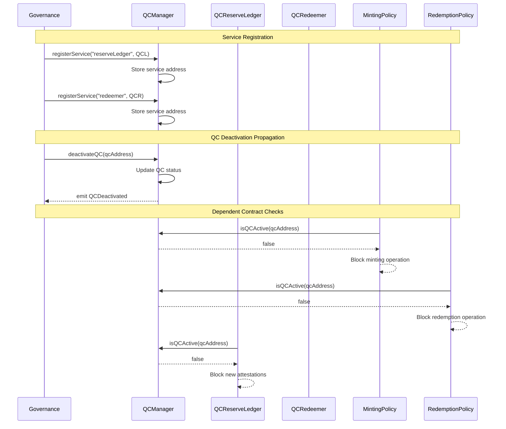
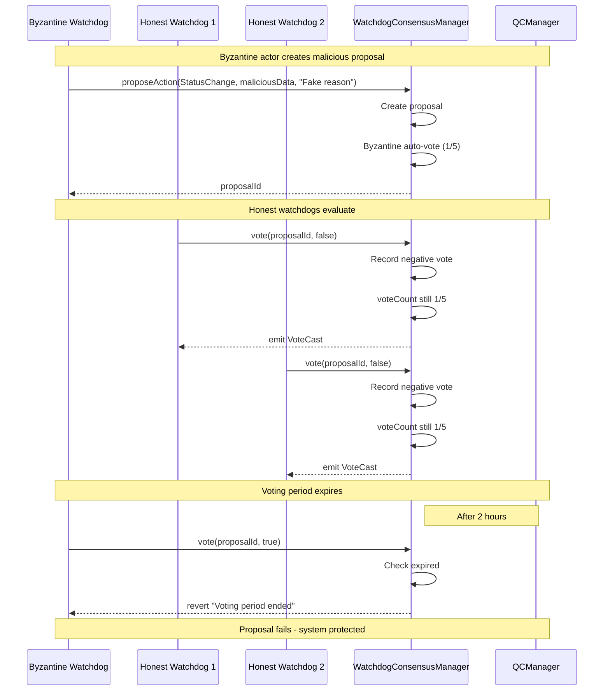

# Sequence Diagrams: V1.1/V1.2 Key Flows

**Version**: 1.0  
**Date**: 2025-08-05

---

## 1. QC Registration and Wallet Setup

---

## 2. Reserve Attestation Flow

---

## 3. Minting Operation Flow

---

## 4. Redemption Lifecycle Flow

---

## 5. Consensus Voting Flow (M-of-N)

---

## 6. Emergency Detection and Response

---

## 7. V1.2 Automated Rule Enforcement

---

## 8. Cross-Contract State Synchronization

---

## 9. Byzantine Fault Scenario

---

## Key Design Patterns

### 1. NonReentrant Pattern
All state-changing functions that make external calls use the `nonReentrant` modifier to prevent reentrancy attacks.

### 2. Check-Effects-Interactions
State changes occur before external calls to prevent reentrancy vulnerabilities.

### 3. Access Control
Role-based permissions checked at the beginning of each function.

### 4. Pause Mechanism
SystemState pause checks integrated at critical points in all flows.

### 5. Time-Window Validation
Consistent pattern for time-based logic (redemption timeouts, voting periods, report windows).

### 6. Event Emission
Comprehensive event logging for all state changes and critical actions.

### 7. Fail-Safe Defaults
System defaults to secure state (paused, not authorized) in error conditions.

---

## Integration Testing Considerations

When testing these flows:

1. **Timing**: Use `hardhat` time manipulation to test time-dependent flows
2. **Permissions**: Test with unauthorized callers to verify access control
3. **State Dependencies**: Ensure proper setup (QC registered, wallets added, etc.)
4. **Edge Cases**: Test boundary conditions (exact thresholds, timeouts)
5. **Concurrency**: Test simultaneous operations to check for race conditions
6. **Byzantine Behavior**: Test with malicious actors to verify security