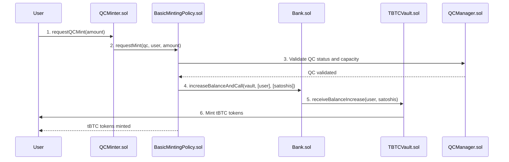
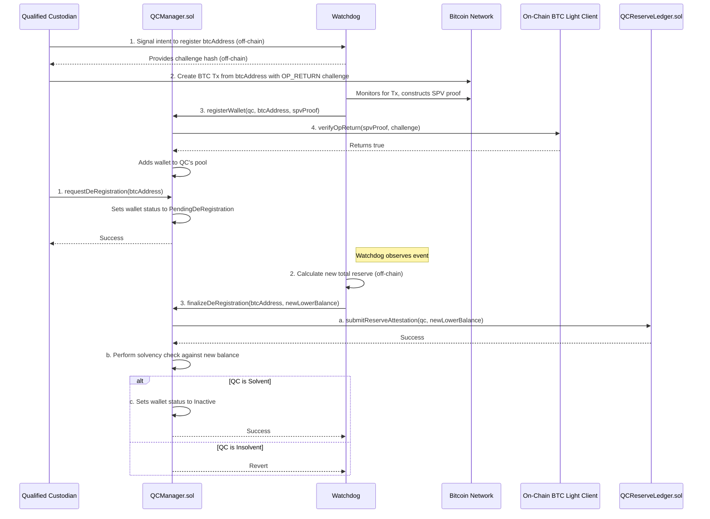
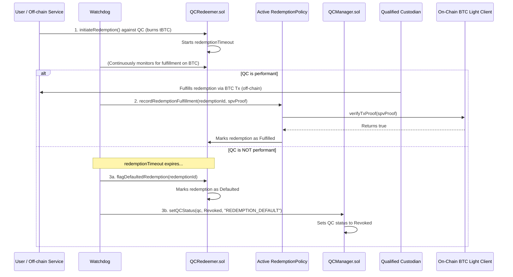
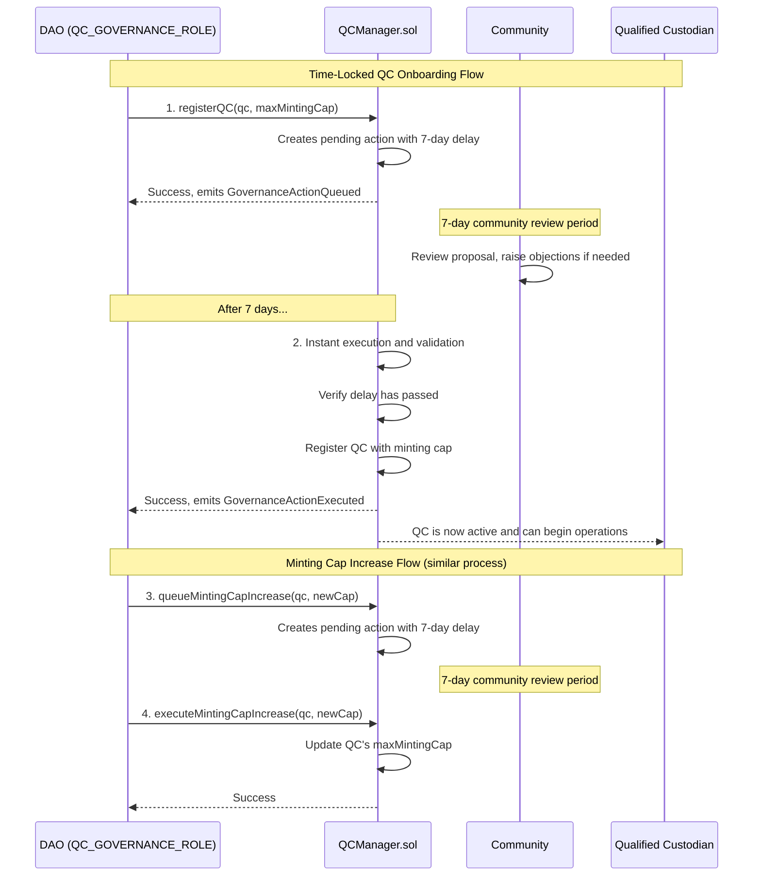

# Account Control Architecture for tBTC v2

**Document Version**: 1.0  
**Date**: 2025-07-11  
**Architecture**: Direct Bank Integration  
**Purpose**: Detailed technical architecture specification  
**Related Documents**: [README.md](README.md), [REQUIREMENTS.md](REQUIREMENTS.md), [IMPLEMENTATION.md](IMPLEMENTATION.md), [RESEARCH.md](RESEARCH.md)

---

## 1. Technical Architecture Overview

This document provides detailed technical architecture for the Account Control system implemented through direct Bank integration. For business requirements and high-level overview, see [README.md](README.md) and [REQUIREMENTS.md](REQUIREMENTS.md).

### 1.1 Architectural Principles

The Account Control architecture is built on four core principles:

1. **Direct Integration**: Leverage existing Bank/Vault infrastructure without abstraction layers
2. **Modular Design**: Policy-driven contracts enable evolution without breaking core interfaces
3. **Data/Logic Separation**: Clear separation between storage (QCData) and business logic (QCManager)
4. **Future-Proof Interfaces**: Stable core contracts with upgradeable policy implementations

### 1.2 System Architecture Diagram

```
┌─────────────────┐    ┌──────────────────┐    ┌─────────────────┐
│   QCMinter      │────│ BasicMintingPolicy│────│   Bank.sol      │
│  (Entry Point)  │    │ (Direct Integration)│   │ (Existing)      │
└─────────────────┘    └──────────────────┘    └─────────────────┘
         │                        │                        │
         │              ┌─────────────────┐               │
         └──────────────│ ProtocolRegistry│               │
                        │ (Service Locator)│               │
                        └─────────────────┘               │
                                 │                        │
              ┌──────────────────┼──────────────────┐     │
              │                  │                  │     │
    ┌─────────────────┐ ┌─────────────────┐ ┌─────────────────┐ │
    │   QCManager     │ │    QCData       │ │  SystemState    │ │
    │ (Business Logic)│ │   (Storage)     │ │ (Global State)  │ │
    └─────────────────┘ └─────────────────┘ └─────────────────┘ │
                                                                │
                        ┌─────────────────┐                    │
                        │   TBTCVault     │◄───────────────────┘
                        │   (Existing)    │
                        └─────────────────┘
                                 │
                    ┌─────────────────────────────────────────────┐
                    │         V1.1 Watchdog Quorum System          │
                    │                                             │
                    │  ┌─────────────────────┐ ┌─────────────────┐ │
                    │  │OptimisticWatchdog   │ │  WatchdogAdapter │ │
                    │  │     Consensus       │ │  (Compatibility) │ │
                    │  │ (N-of-M Quorum)     │ │                 │ │
                    │  └─────────────────────┘ └─────────────────┘ │
                    │            │                       │        │
                    │            └───────────────────────┘        │
                    └─────────────────────────────────────────────┘
```

## 2. Smart Contract Architecture

The architecture's strength lies in its modularity and the principle of
separation of concerns. Instead of a single monolithic contract, the system is a
suite of specialized, interoperable contracts. This design enhances clarity,
maintainability, and future upgradeability. Core contracts are designed as
stable shells that delegate complex, evolving logic to external **"Policy"**
contracts. This allows the DAO to upgrade the system's behavior over time—for
instance, moving from a Watchdog-arbitrated V1 to a trust-minimized V2 with
on-chain challenges—by simply deploying new Policy modules and updating
pointers, without altering the core contract interfaces.

### 2.1 `BasicMintingPolicy.sol` (The Direct Bank Integration)

**CORE COMPONENT**: This contract is the cornerstone of the QC integration,
acting as the direct interface between Account Control and the existing tBTC
Bank/Vault architecture. It enables QC-backed reserves to create Bank
balances and mint tBTC tokens seamlessly.

- **Key Features:**
  - Directly calls Bank.increaseBalanceAndCall() for seamless integration
  - Validates QC status, capacity, and system state before minting
  - Supports both auto-minting and manual minting workflows
  - Provides comprehensive error handling and validation
  - Maintains authorization through Bank's authorized balance increasers

### 2.2 `ProtocolRegistry.sol`

This contract is the cornerstone of the architecture's modularity, acting as a
central, dynamic address book. It decouples all system contracts, enabling
upgrades to individual components without requiring a full-system redeployment.

### 2.3 `QCManager.sol`, `QCData.sol`, and `SystemState.sol`

To enforce the Single Responsibility Principle, logic, data, and global state
are broken down into three focused contracts.

**1. `QCData.sol` (The State Store)** This contract serves as the dedicated,
auditable storage layer for all data related to Qualified Custodians and their
wallets. By isolating state, the system can upgrade logic contracts without
performing complex and risky data migrations. It stores `Custodian` and `Wallet`
structs, governed by `QCStatus` and `WalletStatus` enums.

- **`QCStatus`**: `Active`, `UnderReview`, `Revoked`
- **`WalletStatus`**: `Inactive`, `Active`, `PendingDeRegistration`

**2. `QCManager.sol` (The Logic Controller)** This contract contains all the
business logic for managing QCs. It is stateless itself, reading from and
writing to `QCData` and `SystemState` via the central `ProtocolRegistry`. It
manages QC status changes and wallet registration flows.

**3. `SystemState.sol` (The Global State)** This contract holds global
parameters and emergency controls (e.g., `isMintingPaused`), providing a single,
auditable location for system-wide state.

### 2.4 `QCReserveLedger.sol` (The Reserve Ledger)

This contract is exclusively responsible for recording off-chain reserve data
submitted by a trusted attester (the Watchdog). It contains a `STALE_THRESHOLD`
parameter to ensure reserve data is fresh.

### 2.5 `QCMinter.sol` (The Minting Engine)

A focused contract that acts as a stable entry point for minting `tBTC`. It
delegates the core validation and minting logic to a pluggable "Minting Policy"
contract (`IMintingPolicy`), allowing the minting rules to be upgraded without
changing the core minter contract.

### 2.6 `BasicMintingPolicy.sol` (The Minting Policy Implementation)

**CORE COMPONENT**: This contract implements the `IMintingPolicy` interface
with direct Bank integration, enabling seamless integration with the Bank/Vault architecture.

- **Key Features:**
  - Direct Bank integration using Bank.increaseBalanceAndCall()
  - Validates QC status, capacity, and system state
  - Converts tBTC amounts to satoshis for Bank operations
  - Supports both auto-mint and manual mint workflows
  - Authorized as a balance increaser in the Bank contract

### 2.7 `QCRedeemer.sol` (The Redemption Engine)

This contract manages the entire lifecycle of a redemption request, delegating
fulfillment and default handling logic to a pluggable "Redemption Policy"
(`IRedemptionPolicy`). It tracks redemptions via a `Redemption` struct and a
`RedemptionStatus` enum (`NeverInitiated`, `Pending`, `Fulfilled`, `Defaulted`).

### 2.8 `Bridge.sol`, `Bank.sol`, and `TBTCVault.sol` (Enhanced Integration)

**UPDATED INTEGRATION**: The existing contracts have been enhanced to support
direct BasicMintingPolicy integration while maintaining backward compatibility.

- **Bank Contract Modifications:**

  - Added `authorizedBalanceIncreasers` mapping to allow BasicMintingPolicy to increase balances
  - Modified `onlyBridge` modifier to `onlyAuthorizedIncreaser` for inclusive access
  - Added `setAuthorizedBalanceIncreaser()` function for managing authorized contracts

- **Key Integration Points:**
  - **Bank Integration**: BasicMintingPolicy is authorized as a balance increaser via `authorizedBalanceIncreasers`
  - **Vault Integration**: Auto-minting uses `increaseBalanceAndCall()` to trigger `TBTCVault.receiveBalanceIncrease()`
  - **Shared Infrastructure**: Both regular Bridge and BasicMintingPolicy use the same Bank and TBTCVault infrastructure

### 2.9 V1.1 Watchdog Quorum Architecture

**CORE COMPONENT**: The V1.1 system implements an optimistic N-of-M watchdog quorum
that provides Byzantine fault tolerance while maintaining gas efficiency through
proven optimistic execution patterns.

#### 2.9.1 OptimisticWatchdogConsensus.sol

**Primary Component**: Implements the core consensus mechanism with the following features:

- **MEV-Resistant Validator Selection**: Uses blockhash-based randomness for primary validator selection
- **Optimistic Execution**: Primary validators submit operations that execute after challenge periods
- **Escalating Consensus**: Progressive delays (1h→4h→12h→24h) based on objection count
- **Approval Mechanism**: Explicit approvals required for highly disputed operations (≥3 objections)
- **Emergency Override**: Governance can execute operations immediately in extreme scenarios

```solidity
// Core consensus structure
struct WatchdogOperation {
    bytes32 operationType;      // ATTESTATION, REGISTRATION, STATUS_CHANGE, REDEMPTION
    bytes operationData;        // Encoded operation parameters
    address primaryValidator;   // Selected primary validator
    uint64 submittedAt;        // Submission timestamp
    uint64 finalizedAt;        // Execution timestamp
    uint8 objectionCount;      // Number of challenges
    bool executed;             // Execution status
    bool challenged;           // Challenge status
}
```

#### 2.9.2 WatchdogAdapter.sol

**Compatibility Component**: Provides backward compatibility with the SingleWatchdog interface
while routing operations through the consensus system:

- **Dual Execution Path**: Consensus routing for active watchdogs, direct execution for operators
- **Event Compatibility**: Maintains all SingleWatchdog events for monitoring systems
- **Role-Based Access**: Supports existing WATCHDOG_OPERATOR_ROLE permissions
- **Operation Encoding**: Handles all operation types (attestation, registration, status change, redemption)

#### 2.9.3 Security Features

- **Reentrancy Protection**: All execution functions protected by OpenZeppelin's ReentrancyGuard
- **Access Control**: Role-based permissions with emergency and management roles
- **Input Validation**: Comprehensive validation of operation parameters and states
- **Byzantine Fault Tolerance**: Tolerates up to (N-1)/3 Byzantine failures

### 2.10 Gas Optimization Strategy

**Storage Layout Optimization**:

```solidity
// Optimized for 32-byte storage slots
struct QCData {
  QCStatus status; // 1 byte
  uint88 maxMintingCapacity; // 11 bytes
  uint88 currentMinted; // 11 bytes
  uint64 lastReserveUpdate; // 8 bytes
  uint8 reserved; // 1 byte
  // Total: 32 bytes (1 storage slot)
}

```

**Gas Cost Targets**:

- QC Registration: < 500,000 gas
- Minting Operation: < 150,000 gas
- Redemption Request: < 100,000 gas
- Risk Assessment Update: < 80,000 gas

**Computational Optimization**:

- External libraries reduce deployment gas costs
- Pure functions enable compile-time optimization
- Batch operations reduce transaction costs
- Lazy evaluation for expensive calculations

## 3. Off-chain Components: Optimistic Watchdog Quorum

The protocol implements an **Optimistic N-of-M Watchdog Quorum** for decentralized,
on-chain reporting. This system provides Byzantine fault tolerance while maintaining
gas efficiency through optimistic execution patterns.

- **Key Functions & Responsibilities:**
  - **Decentralized Quorum:** Multiple DAO-appointed watchdogs form an N-of-M consensus system
  - **Optimistic Execution:** Primary validator submits operations optimistically with challenge periods
  - **Progressive Consensus:** Escalating delays and approval thresholds based on objection levels
  - **MEV-Resistant Selection:** Primary validator selection using blockhash-based randomness
  - **Proof-of-Reserves Attestation:** Continuously monitors all registered QC
    Bitcoin addresses through distributed consensus on `OptimisticWatchdogConsensus.sol`
  - **Delinquency Arbitration:** Acts as the trusted on-chain arbiter for
    redemption failures. It monitors pending redemptions, investigates timeouts,
    and calls `recordRedemptionFulfillment` or `flagDefaultedRedemption` on
    `QCRedeemer.sol`. If a default occurs, it calls `setQCStatus` on
    `QCManager.sol` to revoke the QC's rights.
  - **Proof-of-Control Verification:** Observes `OP_RETURN` challenges during
    wallet registrations and submits the SPV proof to call `registerWallet` on
    `QCManager.sol`.

### 2.3 Security Roles & Separation of Duties

The architecture moves away from a single "Guardian" to a system of granular,
on-chain roles to enforce separation of duties and the principle of least
privilege.

- **`DEFAULT_ADMIN_ROLE` (The DAO):** The highest authority, responsible for
  appointing all other roles and managing the `ProtocolRegistry`.
- **`PARAMETER_ADMIN_ROLE` (The DAO):** Responsible for tuning non-critical system
  parameters, such as timeouts and thresholds, and for upgrading Policy
  contracts.
- **`QC_GOVERNANCE_ROLE` (The DAO):** Responsible for instant governance actions
  that require time-locked execution, including:
  - **QC Onboarding:** Adding new QC entities to the system
  - **Minting Cap Increases:** Increasing `maxMintingCap` for existing QCs
  - **Major Protocol Upgrades:** Significant system-wide changes
- **Watchdog Roles:** The Watchdog entity is granted a specific set of
  permissions:
  - **`ATTESTER_ROLE`**: The permission to submit reserve balance attestations
    to the `QCReserveLedger`.
  - **`REGISTRAR_ROLE`**: The permission to finalize wallet registrations by
    calling `registerWallet` in `QCManager`.
  - **`ARBITER_ROLE`**: The permission to flag redemption defaults and change a
    QC's status (e.g., to `UnderReview` or `Revoked`) in `QCManager`. This role
    can act **instantly** for emergency actions like pausing or removing QCs.
- **`PAUSER_ROLE` (The Emergency Council):** A separate, technical multi-sig
  with the limited power to trigger a granular, temporary pause on specific
  system functions (e.g., `pauseMinting()`, `pauseRedemptions()`). This surgical
  approach minimizes disruption during a crisis and operates **instantly** without
  time delays.

This multi-role system ensures no single entity has unilateral power over the
entire system, creating checks and balances. The time-locked governance for
onboarding and cap increases provides community oversight while maintaining rapid
response capabilities for emergencies.

### 2.4 User Flows

#### 2.4.1 QC Minting Flow (Direct Bank Integration)

The minting flow is streamlined through direct Bank integration, providing a
single-step experience for users.

**Updated Flow:**

```
User → QCMinter → BasicMintingPolicy → Bank → TBTCVault → tBTC Tokens
```

**Step-by-Step Process:**

1. User calls `QCMinter.requestQCMint()` with tBTC amount
2. QCMinter validates request and calls `BasicMintingPolicy.requestMint()`
3. BasicMintingPolicy validates:
   - QC status (must be Active)
   - System state (minting not paused)
   - Amount limits (within min/max bounds)
   - QC capacity (sufficient reserves)
4. BasicMintingPolicy converts tBTC to satoshis and calls `Bank.increaseBalanceAndCall()`
5. Bank creates balance and calls `TBTCVault.receiveBalanceIncrease()`
6. TBTCVault mints tBTC tokens directly to user



#### 2.4.2 QC Wallet Registration & De-registration Flow

Wallet management is hardened with mandatory, on-chain cryptographic
verification for critical actions.

1. **Registration (SPV-Verified):** A QC proves control of a BTC address via an
   `OP_RETURN` transaction. The Watchdog observes this and calls
   `registerWallet` with an SPV proof, which `QCManager` verifies against the
   on-chain BTC light client.
2. **De-registration (Hardened On-Chain Flow):** A two-step process to prevent
   race conditions.
   1. **Request:** The QC calls `requestDeRegistration(btcAddress)` on
      `QCManager`.
   2. **Finalize:** The Watchdog later performs an atomic action by calling
      `finalizeDeRegistration(btcAddress, newBalance)`, which simultaneously
      updates the reserve attestation and performs a solvency check before
      removing the wallet.



#### 2.4.3 System Health and Coexistence

The direct Bank integration ensures seamless coexistence with the regular Bridge:

**Separation of Concerns:**

- **Regular Bridge**: Handles DKG wallet management and Bitcoin SPV verification
- **BasicMintingPolicy**: Handles QC reserve management and attestation verification
- **Shared Components**: Both use same Bank and TBTCVault infrastructure

**Authorization Model:**

```solidity
// Bank contract maintains separate authorization for balance increasers
mapping(address => bool) public authorizedBalanceIncreasers;

// Both Bridge and BasicMintingPolicy are authorized:
authorizedBalanceIncreasers[bridgeAddress] = true;              // Regular Bridge
authorizedBalanceIncreasers[basicMintingPolicyAddress] = true;  // QC Minting
```

#### 2.4.4 Redemption Flow & Delinquency Enforcement

1. **Initiation:** A user calls `initiateRedemption` on `QCRedeemer`, burning
   `tBTC` and creating a `Pending` redemption request.
2. **Fulfillment:** The Watchdog observes the fulfillment BTC transaction,
   constructs an SPV proof, and calls `recordRedemptionFulfillment`. The
   `RedemptionPolicy` verifies the proof and marks the redemption `Fulfilled`.
3. **Delinquency:** If the `redemptionTimeout` expires, the Watchdog first calls
   `flagDefaultedRedemption` (marking the request `Defaulted`) and then
   `setQCStatus(qc, Revoked)` to permanently revoke the QC's rights.



#### 2.4.5 Reserve Attestation Flow

The Watchdog constantly monitors QC balances off-chain but only submits an
on-chain attestation to `QCReserveLedger` under critical conditions: to flag
potential insolvency, to prevent a valid attestation from becoming stale, or to
support a wallet de-registration.

#### 2.4.6 QC Status Management Flow (UnderReview & Recovery)

The `UnderReview` status is a temporary "yellow card" to pause a QC's minting
rights. It can be triggered automatically if a new reserve attestation reveals a
QC is undercollateralized, or manually by an arbiter. To recover, the QC must
resolve the issue off-chain, after which an arbiter can restore its `Active`
status.

#### 2.4.7 Emergency Pause Flow

The Emergency Council (`PAUSER_ROLE`) can surgically halt specific functions
(e.g., `pauseMinting()`) via the `SystemState` contract in response to an
immediate threat, without freezing the entire protocol.

#### 2.4.8 Time-Locked Governance Flow (New QC Onboarding & Minting Cap Increases)

Critical governance actions now require a mandatory delay to provide community oversight while preserving emergency response capabilities.

**QC Onboarding Flow:**

1. **Instant Action:** The DAO calls `registerQC(qcAddress, maxMintingCap)` on `QCManager.sol`.
2. **Immediate Execution:** The system performs instant validation and onboarding.
3. **Role-Based Security:** Access control through QC_GOVERNANCE_ROLE provides security.

**Minting Cap Increase Flow:**

1. **Instant Action:** The DAO calls `increaseMintingCapacity(qcAddress, newCap)` on `QCManager.sol`.
2. **Immediate Execution:** The system performs instant validation and capacity increase.
3. **Role-Based Security:** Access control through QC_GOVERNANCE_ROLE provides security.



## 3. Governance Considerations

The DAO's role is high-level oversight, with new mechanisms to protect against
failure or capture and implement time-locked governance for critical actions.

- **Time-Locked Critical Actions:** The following actions now require a mandatory
  governance delay (typically 7 days) to provide community oversight:
  - **Onboarding QCs:** Vetting and registering new QC entities through a
    two-step queue-and-execute process.
  - **Minting Cap Increases:** Raising the `maxMintingCap` for existing QCs
    requires advance notice and community review.
  - **Major Protocol Upgrades:** Significant changes to core system parameters
    or contract implementations.
- **Instant Emergency Actions:** The following actions can be executed immediately
  without delay to respond to threats:
  - **QC Status Changes:** Moving QCs to `UnderReview` or `Revoked` status.
  - **Emergency Pauses:** Surgical halting of specific system functions.
  - **QC Removal:** Immediate revocation of QC rights in case of defaults.
- **Managing Protocol Parameters:** Setting and adjusting non-critical parameters
  such as timeouts and thresholds can be done without delay.
- **Appointing and Managing Security Roles:** Appointing the Watchdog, Emergency
  Council, and other roles.
- **Arbitrating Status:** Acting as the final arbiter for a QC (e.g., moving
  them from `UnderReview` back to `Active`).
- **Governance Failsafe (Emergency Council):** A separate, technical multi-sig
  with limited pause powers for rapid crisis response, operating without time
  delays.

## 4. Security and Economic Considerations

### 4.1 Direct Bank Integration Security Model

The direct Bank integration introduces several security considerations:

**Strengths:**

- Direct integration with proven Bank contract architecture
- Role-based access control with separation of duties
- Comprehensive input validation and system health checks
- Coexistence with existing Bridge without conflicts
- Simpler architecture reduces attack surface

**Key Risks:**

- **QC Reserve Attestation Trust Model**: Relies on QC attestations without
  cryptographic proof of Bitcoin holdings
- **Bank Authorization**: BasicMintingPolicy must be properly authorized in Bank
- **Centralized Watchdog**: Single point of failure for liveness and correctness

### 4.2 Solvency Checks & Default Handling

The V1 solvency model is based on a trust-and-verify system, backed by legal
agreements.

1. **Solvency Check:** A QC is solvent if its minted `tBTC` is less than or
   equal to its attested BTC reserves. This is checked during wallet
   de-registration.
2. **Default Scenario:** When a default is signaled by the Watchdog, the QC's
   status is set to `Revoked`. The smart contract **cannot** seize any assets.
   The loss from the default is **socialized** across all `tBTC` holders. User
   recourse is limited to off-chain legal agreements.

### 4.3 Key Acknowledged Risks for V1

- **Watchdog Quorum Resilience (Improved):** The V1.1 protocol implements an
  optimistic N-of-M watchdog quorum, significantly reducing single points of
  failure. The system can tolerate up to (N-1)/3 Byzantine failures while
  maintaining liveness. MEV-resistant selection and escalating consensus
  provide additional security. Emergency override capabilities ensure
  governance can intervene in extreme scenarios.
- **Socialized Default Risk (Critical):** The protocol merges the risk profiles
  of DKG-backed and QC-backed `tBTC`. A QC default will result in an immediate,
  socialized loss across _all_ `tBTC` holders. Recourse is limited to off-chain
  legal agreements.
- **Counterparty and Legal Recourse Risk:** The system relies on the assumption
  that regulated QCs will honor their obligations. The final security guarantee
  shifts from on-chain crypto-economics to off-chain legal contracts and the
  court system.
- **Instantaneous Governance (Partially Mitigated):** V1 now implements time-locked
  governance for critical actions like QC onboarding and minting cap increases,
  providing a 7-day window for community oversight. However, emergency actions
  (QC pausing/removal, status changes) remain instantaneous by design to enable
  rapid threat response. While this reduces governance risk for routine operations,
  it still places high trust in the security of emergency action roles and the
  DAO's governance keys.
- **Implementation Risk:** The complexity of the modular system and its
  off-chain dependencies is high.
- **MEV Risk in Minting:** The V1 minting process is vulnerable to
  front-running. This will be mitigated in a future version with a commit-reveal
  scheme.

## 5. Monitoring and Alerts

For enhanced monitoring, security, and off-chain tooling, every state change and
critical action within the contracts must emit a detailed event.

- **`QCManager.sol` Events:**
  - `QCStatusChanged(address indexed qc, QCStatus oldStatus, QCStatus newStatus, bytes32 reason)`
  - `WalletRegistered(address indexed qc, string btcAddress)`
  - `WalletDeRegistrationRequested(address indexed qc, string btcAddress)`
  - `WalletDeRegistrationFinalized(address indexed qc, string btcAddress)`
  - `GovernanceActionQueued(bytes32 indexed actionHash, uint256 executeAfter, string actionType)`
  - `GovernanceActionExecuted(bytes32 indexed actionHash, string actionType)`
  - `QCOnboarded(address indexed qc, uint256 maxMintingCap)`
  - `MintingCapIncreased(address indexed qc, uint256 oldCap, uint256 newCap)`
- **`QCReserveLedger.sol` Events:**
  - `ReserveAttestationSubmitted(address indexed attester, address indexed qc, uint256 newBalance, uint256 timestamp)`
- **`QCMinter.sol` Events:**
  - `QCMintRequested(address indexed qc, uint256 amount)`
  - `MintingPolicyUpdated(address indexed newPolicy)`
- **`QCRedeemer.sol` Events:**
  - `RedemptionRequested(bytes32 indexed redemptionId, address indexed user, address indexed qc, uint256 amount)`
  - `RedemptionFulfilled(bytes32 indexed redemptionId)`
  - `RedemptionDefaulted(bytes32 indexed redemptionId)`
  - `RedemptionPolicyUpdated(address indexed newPolicy)`
- **`SystemState.sol` Events:**
  - Events for pausing and unpausing specific functionalities.

## 6. Design Rationale - Simplified Minting Architecture

### Overview

Following YAGNI principles and production requirements analysis, the Account Control system implements a streamlined single-step minting process that directly integrates with the Bank/Vault infrastructure.

### Direct Bank Integration

The `BasicMintingPolicy.requestMint()` function implements a simple, efficient flow:

- Creates Bank balance AND immediately mints tBTC tokens in one atomic operation
- Eliminates complexity of two-step processes
- Reduces gas costs and operational overhead

### Design Benefits

1. **Simplicity**: Single function, single transaction, predictable outcome
2. **Gas Efficiency**: One transaction for the complete minting process
3. **Security**: Atomic operation prevents intermediate states
4. **User Experience**: Clear, straightforward minting flow

### Production-Driven Architecture

After extensive analysis, the two-step minting process (previously `requestMintWithOption`) was removed because:

- No production use cases required delayed minting
- Batch operations can be handled at the application layer
- Simpler contracts are easier to audit and maintain
- Reduced attack surface from fewer state transitions

### Comparison with Classic Bridge

#### Classic Bridge Approach

- Creates Bank balance first, then requires manual `TBTCVault.mint()` call
- Two-phase process necessitated by Bitcoin's async nature and SPV requirements
- Designed for trustless, decentralized operation

#### Account Control Approach

- Single atomic operation: deposit acknowledgment and token creation
- Instant verification through Watchdog attestation
- Optimized for institutional, regulated entities

### Why This Difference Makes Sense

1. **Different Trust Models**: Bridge is trustless, Account Control uses regulated entities
2. **Different Timing**: Bridge handles async Bitcoin, Account Control has instant attestations
3. **Different Users**: Bridge serves anyone, Account Control serves institutions
4. **Different Goals**: Bridge maximizes decentralization, Account Control maximizes efficiency

### Integration with Existing Infrastructure

The BasicMintingPolicy seamlessly integrates with tBTC's existing infrastructure:

```solidity
// Auto-mint flow
BasicMintingPolicy → Bank.increaseBalanceAndCall() → TBTCVault.receiveBalanceIncrease() → Mint tBTC

// Manual mint flow
BasicMintingPolicy → Bank.increaseBalance() → User later calls → TBTCVault.mint()
```

Both paths use the same underlying Bank and TBTCVault contracts, ensuring consistency and security.

### Security Considerations

1. **Input Validation**: Both paths include comprehensive validation
2. **Authorization**: BasicMintingPolicy must be authorized in Bank
3. **Validation**: Same checks regardless of auto-mint choice
4. **Atomicity**: Auto-mint ensures all-or-nothing execution

### Conclusion

The `autoMint` flag represents a thoughtful balance between:

- **Simplicity**: Clear, binary choice
- **Flexibility**: Supports diverse use cases
- **Compatibility**: Works within existing tBTC architecture
- **Future-Proofing**: Can evolve without breaking changes

This design acknowledges that QC operations are fundamentally different from classic Bridge deposits while providing the flexibility needed for sophisticated institutional use cases.

## 7. Future Extensions & V2 Improvements

The modular, policy-based architecture is explicitly intended to allow for
crucial, trust-minimizing upgrades.

### 7.1 Enhanced Direct Integration Security

- **Cryptographic Proof-of-Reserves**: Implement verifiable Bitcoin reserve
  proofs instead of trust-based attestations.
- **Advanced Access Controls**: Add timelock governance for critical parameter changes.
- **Batch Operations**: Support multiple mints in single transaction.

### 7.2 On-Chain Crypto-Economic Security (Collateralization)

A future `CollateralizedMintingPolicy` could require QCs to post an on-chain
bond in a `CollateralVault.sol`. In a default, this bond could be seized to
compensate the affected user on-chain, moving from a trust-based to a
"trust-but-verify" model.

### 7.3 Governance Time-Locks and Role Decentralization

**Current Implementation (V1):** Time-locked governance for critical actions is now
implemented, requiring a mandatory delay for QC onboarding and minting cap increases
while preserving instant emergency response capabilities.

**Future Enhancements:**

- **Extended Time-Lock Coverage:** Future versions may expand time-locked governance
  to cover additional parameter changes and system upgrades.
- **M-of-N Watchdog Quorum:** The highest priority for V2 is to decentralize the
  Watchdog role to an M-of-N quorum to remove the single point of failure.
- **Advanced Role Granularity:** The monolithic Watchdog role will be further split
  to enforce the principle of least privilege, with on-chain incentives to ensure
  operational sustainability.

### 7.4 Fair Minting and User Experience Enhancements

- **Commit-Reveal for Minting:** To mitigate MEV risk, the `QCMinter` can be
  upgraded to enforce a two-step commit-reveal scheme.
- **User-Initiated Redemption Cancellation:** A mechanism can be added to the
  `QCRedeemer` allowing a user to cancel a stale redemption request to prevent
  locked funds.
- **Cross-Chain Support**: Extend to L2 and sidechains.

## 8. Architecture Decision Records (ADRs)

### 8.1 ADR-001: Library vs Contract Architecture Decision

**Status**: Accepted  
**Date**: 2025-06-24

**Context**: Need to decide between library-based and contract-based architecture for QC functionality.

**Decision**: Use library pattern for core business logic with contract orchestration.

**Rationale**:

- Gas efficiency through external library linking
- Code reusability across multiple contracts
- Easier testing and validation of isolated components
- Modular design enables selective upgrades

**Consequences**:

- Positive: Lower deployment costs, better modularity
- Negative: Additional complexity in library linking

### 8.2 ADR-002: Storage Pattern Decision

**Status**: Accepted  
**Date**: 2025-06-24

**Context**: Choose storage pattern for QC data that balances efficiency and upgradability.

**Decision**: Use struct-based storage with library access patterns.

**Rationale**:

- Storage slot optimization through struct packing
- Clear data organization and access patterns
- Compatibility with existing BridgeState patterns
- Support for future storage layout upgrades

**Consequences**:

- Positive: Optimal gas costs, clear data organization
- Negative: Storage migration complexity for major changes

### 8.3 ADR-003: Oracle Integration Pattern

**Status**: Accepted  
**Date**: 2025-06-24

**Context**: Design oracle integration for reserve attestations with appropriate security.

**Decision**: Single trusted Watchdog with DAO oversight.

**Rationale**:

- Simplified trust model with clear accountability
- Reduced complexity compared to multi-oracle consensus
- Ability to rapidly respond to issues
- Clear path to V2 multi-oracle upgrade

**Consequences**:

- Positive: Simple implementation, clear responsibilities
- Negative: Single point of failure, trust dependency

### 8.4 ADR-004: Risk Assessment Architecture

**Status**: Accepted  
**Date**: 2025-06-24

**Context**: Design solvency monitoring system that is simple and efficient.

**Decision**: Simple reserve vs minted balance comparison with strategic attestation.

**Rationale**:

- Clear and auditable solvency model
- Low computational overhead
- Strategic attestation reduces on-chain costs
- Easily extensible for future risk models

**Consequences**:

- Positive: Simple and reliable solvency verification, low gas costs
- Negative: Relies on trusted Watchdog, less sophisticated risk modeling

### 8.5 ADR-005: Integration Strategy with Existing Bridge

**Status**: Accepted  
**Date**: 2025-06-24

**Context**: Determine how to integrate QC functionality with existing Bridge contract.

**Decision**: Direct Bank integration through BasicMintingPolicy.

**Rationale**:

- Zero breaking changes to existing functionality
- Clear separation of concerns
- Simplified architecture with direct Bank calls
- Reduced risk to existing system
- Leverages existing Bank authorization patterns

**Consequences**:

- Positive: Seamless integration, backward compatibility, simpler architecture
- Negative: Requires Bank authorization management

### 8.6 ADR-006: Time-Locked Governance Implementation

**Status**: Accepted  
**Date**: 2025-06-24

**Context**: Balance community oversight with operational efficiency for critical actions.

**Decision**: Implement time-locked governance for QC onboarding and minting cap increases.

**Rationale**:

- Provides community review period for critical decisions
- Maintains instant response for emergency actions
- Balances decentralization with operational needs
- Clear separation between routine and emergency actions

**Consequences**:

- Positive: Enhanced governance transparency, community oversight
- Negative: Delayed execution for routine operations, increased complexity

## 9. Deployment Architecture & System Capacity

### 9.1 Phased Deployment Strategy

**Phase 1: Foundation Deployment**

- Core Libraries: QCDataTypes, QCMath, QCEvents, QCValidation
- Risk Assessment: QCRiskAssessment
- Testing Infrastructure: Mock contracts, test utilities, integration helpers

**Phase 2: Core Logic Deployment**

- Storage Management: QCStorageManager
- Oracle Integration: QCOracleManager
- Integration Testing: Component integration tests, oracle consensus testing

**Phase 3: Direct Bank Integration**

- Policy Integration: BasicMintingPolicy with direct Bank calls
- System Configuration: Parameter initialization, role assignments, Bank authorization
- End-to-End Testing: Complete workflow testing, security validation, performance benchmarking

### 9.2 System Capacity Design

**Scalability Targets**:

| Metric                    | Target Capacity           | Growth Strategy                     |
| ------------------------- | ------------------------- | ----------------------------------- |
| **QCs Supported**         | 50 active QCs             | Horizontal scaling through sharding |
| **Wallets per QC**        | 20 Bitcoin addresses      | Dynamic allocation based on needs   |
| **Concurrent Operations** | 1000+ simultaneous        | Batch processing optimization       |
| **Data Retention**        | 5+ years operational data | Efficient archival and pruning      |

### 9.3 Deployment Scripts Architecture

**Hardhat Deploy Pattern**:

```typescript
// Following tBTC v2 numbered deployment pattern
deploy/
├── 50_deploy_qc_libraries.ts
├── 51_deploy_qc_storage.ts
├── 52_deploy_qc_oracle.ts
├── 53_deploy_qc_bridge.ts
└── 54_configure_qc_system.ts
```

**Environment-Specific Configuration**:

- Testnet: Relaxed parameters for testing
- Mainnet: Production-grade security parameters
- Development: Fast iteration parameters

## 10. Monitoring & Observability

### 10.1 Real-Time Monitoring System

```
Monitoring System Architecture
├── Event Stream Processing
│   ├── Smart contract event ingestion
│   ├── Real-time event filtering
│   └── Event correlation and analysis
├── Metrics Collection
│   ├── System health metrics
│   ├── Business operation metrics
│   └── Security incident metrics
├── Alerting System
│   ├── Threshold-based alerts
│   ├── Anomaly detection alerts
│   └── Emergency escalation procedures
└── Dashboard & Visualization
    ├── Real-time system status
    ├── Historical trend analysis
    └── Risk assessment visualizations
```

### 10.2 Key Performance Indicators (KPIs)

**System Health KPIs**:

- QC system uptime percentage
- Average transaction confirmation time
- Oracle consensus success rate
- Risk assessment computation time

**Business Operation KPIs**:

- Active QC count and utilization
- Daily minting/redemption volumes
- Average risk scores across QCs
- Fee collection and distribution rates

**Security KPIs**:

- Number of failed validation attempts
- Oracle consensus disagreement frequency
- Emergency circuit breaker activations
- Time to incident resolution

### 10.3 Alert Classification System

**Severity Levels**:

- **P0 Critical**: System down or security breach
- **P1 High**: Major functionality impaired
- **P2 Medium**: Minor functionality issues
- **P3 Low**: Performance degradation or warnings

**Response Timeline**:

- **0-5 minutes**: Automated alert generation and initial assessment
- **5-15 minutes**: Human verification and initial response
- **15-60 minutes**: Detailed investigation and mitigation
- **1-24 hours**: Full resolution and post-incident analysis
