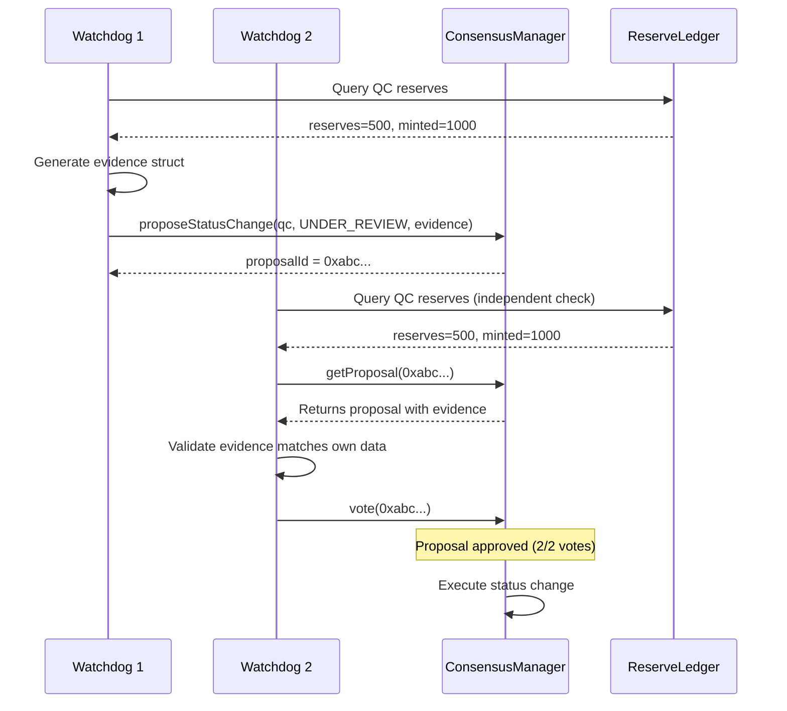

# Watchdog Consensus Evidence System

**Document Version**: 1.0  
**Date**: 2025-08-01  
**Purpose**: Design a machine-interpretable evidence system for watchdog consensus decisions  
**Status**: Design Specification

---

## Problem Statement

The current WatchdogConsensusManager accepts human-readable "reason" strings for proposals, making it impossible for automated watchdogs to:
1. Validate proposal legitimacy independently
2. Prevent duplicate proposals
3. Make informed voting decisions
4. Fulfill their fiduciary obligations programmatically

## Solution: Evidence-Based Consensus

Transform the consensus system from trust-based to evidence-based by requiring machine-interpretable evidence for all proposals.

---

## Core Design Principles

1. **Deterministic Validation**: Any watchdog can independently verify evidence
2. **Idempotency**: Same evidence always produces same proposal ID (prevents duplicates)
3. **Objective Criteria**: All decisions based on measurable, on-chain data
4. **Cryptographic Proof**: Evidence must be verifiable against blockchain state

---

## Evidence Structure

### Base Evidence Type

```solidity
struct Evidence {
    bytes32 evidenceType;      // Type of evidence (e.g., INSUFFICIENT_RESERVES)
    bytes32 dataHash;          // Hash of the evidence data
    uint256 blockNumber;       // Block at which evidence was collected
    bytes signature;           // Optional: signature from data source
}
```

### Proposal Structure (Enhanced)

```solidity
struct Proposal {
    ProposalType proposalType;
    bytes data;                // Encoded action parameters
    Evidence[] evidence;       // Machine-verifiable evidence
    address proposer;
    uint256 voteCount;
    uint256 timestamp;
    bool executed;
    string humanSummary;       // Optional: for monitoring/UI only
}
```

---

## Evidence Types by Proposal

### 1. STATUS_CHANGE Proposals

**Evidence Required**:
```solidity
enum StatusChangeReason {
    INSUFFICIENT_RESERVES,     // reserves < minted amount
    PROLONGED_INACTIVITY,     // no operations for X days
    FRAUD_DETECTED,           // cryptographic proof of fraud
    REGULATORY_ACTION         // signed attestation from authority
}

struct StatusChangeEvidence {
    StatusChangeReason reason;
    bytes32 proofData;        // Depends on reason type
}
```

**Example: Insufficient Reserves**
```solidity
struct InsufficientReservesProof {
    uint256 attestedReserves;
    uint256 mintedAmount;
    uint256 attestationTimestamp;
    address[] attestingWatchdogs;  // Must meet threshold
}
```

### 2. WALLET_DEREGISTRATION Proposals

**Evidence Required**:
```solidity
enum DeregistrationReason {
    WALLET_COMPROMISED,       // Proof of unauthorized transaction
    WALLET_INACTIVE,         // No activity for X days
    QC_REQUEST,              // Signed request from QC
    REGULATORY_REQUIREMENT   // Compliance order
}

struct WalletDeregistrationEvidence {
    DeregistrationReason reason;
    bytes32 btcTxHash;          // For compromise proof
    uint256 lastActivityBlock;   // For inactivity
    bytes signature;            // For QC request
}
```

### 3. REDEMPTION_DEFAULT Proposals

**Evidence Required**:
```solidity
struct RedemptionDefaultEvidence {
    bytes32 redemptionId;
    uint256 requestTimestamp;
    uint256 deadlineTimestamp;
    bool bitcoinTxExists;       // Did QC send BTC?
    bytes32 bitcoinTxHash;      // If exists, why invalid?
    uint256 expectedAmount;
    uint256 actualAmount;       // If underpayment
}
```

---

## Implementation Design

### 1. Enhanced Proposal Creation

```solidity
function proposeStatusChange(
    address qc,
    QCData.QCStatus newStatus,
    Evidence[] calldata evidence
) external onlyRole(WATCHDOG_ROLE) returns (bytes32 proposalId) {
    // Validate evidence matches proposal type
    _validateStatusChangeEvidence(qc, newStatus, evidence);
    
    // Generate deterministic proposal ID from evidence
    proposalId = keccak256(abi.encodePacked(
        ProposalType.STATUS_CHANGE,
        qc,
        newStatus,
        _hashEvidence(evidence)
    ));
    
    // Revert if proposal already exists (prevents duplicates)
    if (proposals[proposalId].timestamp != 0) {
        revert ProposalAlreadyExists(proposalId);
    }
    
    // Create proposal with evidence
    _createProposal(proposalId, ProposalType.STATUS_CHANGE, 
                   abi.encode(qc, newStatus), evidence);
}
```

### 2. Evidence Validation

```solidity
function _validateStatusChangeEvidence(
    address qc,
    QCData.QCStatus newStatus,
    Evidence[] calldata evidence
) internal view {
    // Must have at least one evidence
    if (evidence.length == 0) revert NoEvidenceProvided();
    
    for (uint i = 0; i < evidence.length; i++) {
        Evidence calldata e = evidence[i];
        
        if (e.evidenceType == INSUFFICIENT_RESERVES) {
            // Decode and verify reserve attestations
            InsufficientReservesProof memory proof = 
                abi.decode(e.data, (InsufficientReservesProof));
            
            // Verify: reserves < minted amount
            require(proof.attestedReserves < proof.mintedAmount, 
                   "Reserves sufficient");
            
            // Verify: attestations are recent
            require(block.timestamp - proof.attestationTimestamp < 1 hours,
                   "Stale attestation");
            
            // Verify: enough watchdogs attested
            require(proof.attestingWatchdogs.length >= minAttestations,
                   "Insufficient attestations");
        }
        // ... other evidence types
    }
}
```

### 3. Automated Voting Logic

```solidity
// In watchdog server implementation
async function evaluateProposal(proposalId: string): Promise<boolean> {
    const proposal = await consensusManager.getProposal(proposalId);
    const evidence = proposal.evidence;
    
    // Independently verify each piece of evidence
    for (const e of evidence) {
        switch (e.evidenceType) {
            case 'INSUFFICIENT_RESERVES':
                // Query own reserve attestation data
                const myAttestation = await getLatestAttestation(proposal.qc);
                
                // Compare with evidence
                if (myAttestation.reserves >= myAttestation.mintedAmount) {
                    // Evidence conflicts with my data
                    return false;
                }
                break;
                
            case 'REDEMPTION_TIMEOUT':
                // Verify timeout independently
                const redemption = await redeemer.getRedemption(e.redemptionId);
                const elapsed = Date.now() - redemption.requestTime;
                
                if (elapsed < REDEMPTION_TIMEOUT) {
                    // Not actually timed out
                    return false;
                }
                break;
        }
    }
    
    return true; // All evidence checks passed
}
```

---

## Duplicate Prevention

### Deterministic Proposal IDs

```solidity
// Proposal ID = hash(type + parameters + evidence)
// Same inputs ALWAYS produce same ID

bytes32 proposalId = keccak256(abi.encodePacked(
    proposalType,
    actionParameters,
    evidenceHash
));

// Creating duplicate proposal will revert
if (proposals[proposalId].timestamp != 0) {
    revert ProposalAlreadyExists(proposalId);
}
```

### Evidence Deduplication

```solidity
// Evidence includes block number to prevent replay
struct Evidence {
    bytes32 evidenceType;
    bytes data;
    uint256 blockNumber;  // When evidence was collected
    uint256 expiry;       // Evidence validity period
}

// Old evidence automatically invalid
require(block.number <= evidence.expiry, "Evidence expired");
```

---

## Migration Strategy

### Phase 1: Parallel System
- Deploy new evidence-based contract alongside existing
- Watchdogs use both during transition
- Monitor for consensus divergence

### Phase 2: Evidence Requirement
- Update watchdog software to generate evidence
- Require evidence for new proposals
- Maintain backward compatibility

### Phase 3: Full Migration
- Deprecate string-based reasons
- All decisions evidence-based
- Remove human-readable fields

---

## Benefits

1. **Automated Validation**: Watchdogs can verify all proposals independently
2. **No Blind Trust**: Every vote based on verifiable evidence
3. **Duplicate Prevention**: Deterministic IDs prevent redundant proposals
4. **Audit Trail**: Complete evidence chain for every decision
5. **Regulatory Compliance**: Demonstrable fiduciary duty fulfillment

---

## Example: Insufficient Reserves Flow



---

## Security Considerations

1. **Evidence Tampering**: All evidence must be cryptographically verifiable
2. **Timing Attacks**: Include block numbers to prevent replay
3. **Data Availability**: Evidence must reference on-chain data only
4. **Oracle Trust**: Minimize reliance on external data sources

---

## Conclusion

By replacing human-readable reasons with machine-verifiable evidence, the watchdog consensus system can truly fulfill its automated oversight role. This design ensures that every consensus decision is based on objective, independently verifiable facts rather than trust in the proposer's judgment.